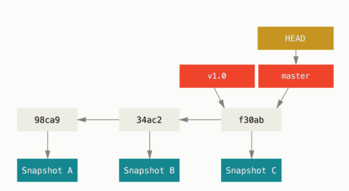

目前公司搭建了一个公共组件库，想用于多个系统，就想到了使用 git 中的子模块 `submodule`

在介绍子模块前先回顾下git的一些基本知识

## commit 操作
1. 每次commit后发生了什么？
  生成commit对象，包括上游指针，作者，提交信息,及指向暂存内容快照的指针


## 分支
分支其实是一个指向commit对象的指针，它会在每次的提交操作中自动向前移动。


## HEAD指针
它是一个指向你正在工作中的本地分支的指针，也可以看成是当前工作分支的一个别名,所以切换分支，其实就是修改HEAD指针的指向，HEAD会随着当前提前往前移动，所以它与分支的指向是一致的



## 游离指针
HEAD 头指针指向了一个具体的提交HASH值，而不是一个引用（分支）

## 子模块

### 什么是子模块
通俗的说就是，在项目中使用共享库代码,且与当前项目相互独立，互不影响

### 基本操作命令
- `git submodule --h` 查看帮助
- `git submodule add`添加子模块
- 生成`.gitmodules`文件
```[submodule "rack"]
      path = rack
      url = git://github.com/chneukirchen/rack.git
```
- 更新方式与普通项目一样

### 克隆一个带子模块的项目
- `git submodule init` 初始化子模块
- `git submodule update` 因为你所拥有的指向子模块的指针和子模块目录的真实状态并不匹配

### 小贴士
1. 子模块的指针是游离态的，所以可以理解为子模块的文件是指针指向的暂存区的文件
2. 在提交子模块的时候，我们提交上去的不是具体的文件，而是子模块当前的指针HASH值
3. 所以根据这一特性，我们可以使用不同的指针来区分版本，举个栗子，子模块有两个分支 `1.0`和`2.0`，在A项目中使用的是`1.0`，在B项目中使用的是`2.0`，那么在A项目中，就把子模块的指针指向`1.0`的首指针,B项目亦同。
4. 一般情况下不建议在子模块中修改代码