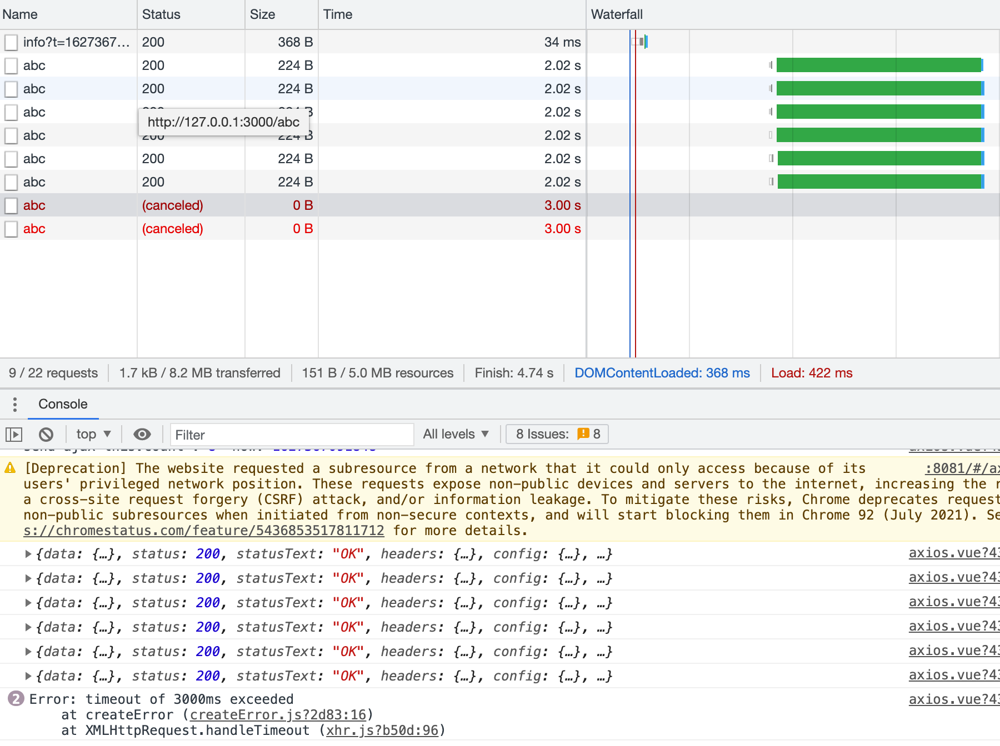
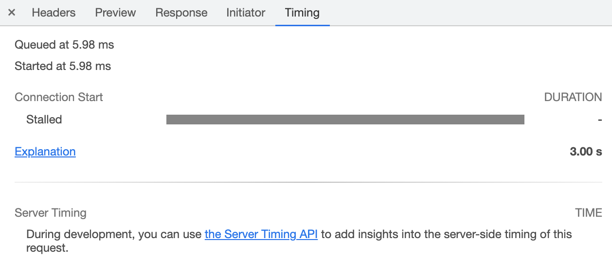
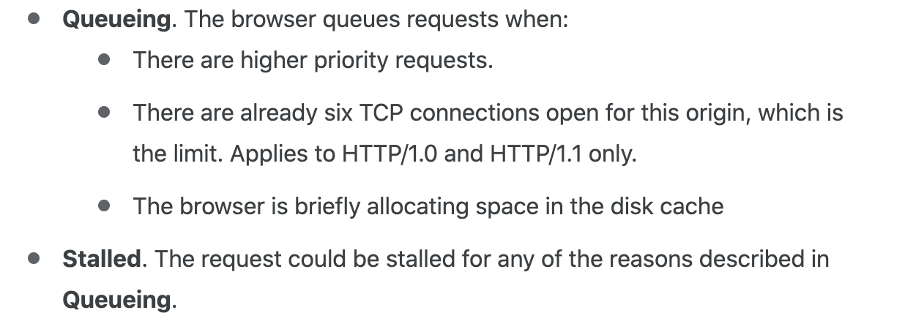
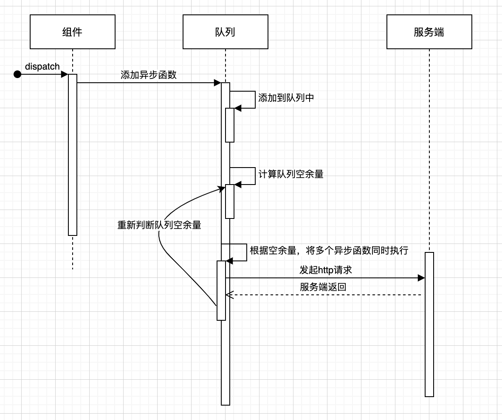
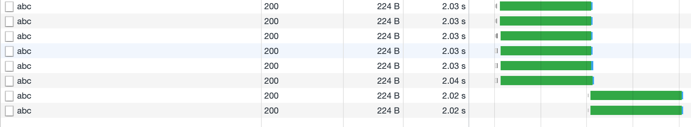
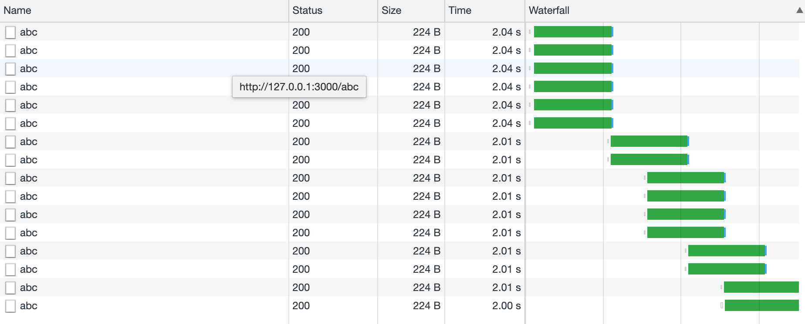

### 因浏览器并发数限制的超时处理
在发起的http请求中，通过设置`timeout`参数，接口请求时间超过设定的超时时间，就会执行 XMLHttpRequest.ontimeout 回调函数中。

大部分场景是没有问题的，单若同时发起的请求数非常交多，且部分接口执行较慢，接口超时时间与我们预期的就不一样。
如下场景：在谷歌浏览器下，使用http1.1协议，同时发起8个请求，超时时间设置为3s，接口执行时间为 2s 

8个请求中，6个成功，2个超时导致失败，这不符合我们的预期，设置的超时时间是明显要大于接口执行时间，预期是要能正常返回的。

在一看发现，这两个失败的请求并没有进到服务端，在看请求面板的 Timing 选项，发现请求并没有执行

大胆的猜测应该是浏览器并发数量的限制，导致请求没有执行，但待执行的请求也进入了队列中，在队列中等待的时间也算在了超时时间内。

在谷歌开发文档中看到这段描述

谷歌浏览器在 http1.1/1.0 协议下，限制最多 6 个TCP链接。

Stalled
在请求能够被发出去前的等等时间，包含了用于处理代理的时间。另外，如果有已经建立好的连接，那么这个时间还包括等待已建立连接被复用的时间，这个遵循Chrome对同一源最大6个TCP连接的规则。

超时原因：同源最大6个TCP连接限制导致

#### 解决办法
1. 换协议解决，使用http2.0 ，支持多路复用
2. 编码解决，限制请求创建数量，将同时执行的请求数量控制在 6 个内。
   
#### 队列存储，定量容器
思路：采用队列存储待执行的请求函数，根据当前执行的数量，来决定队列中的请求是否执行。
设计：

完整代码：

执行效果：

模拟在执行过程中，新增请求函数

### 路由销毁的时候，取消未执行完成的请求

参考链接
https://developer.chrome.com/docs/devtools/network/reference/#timing-explanation