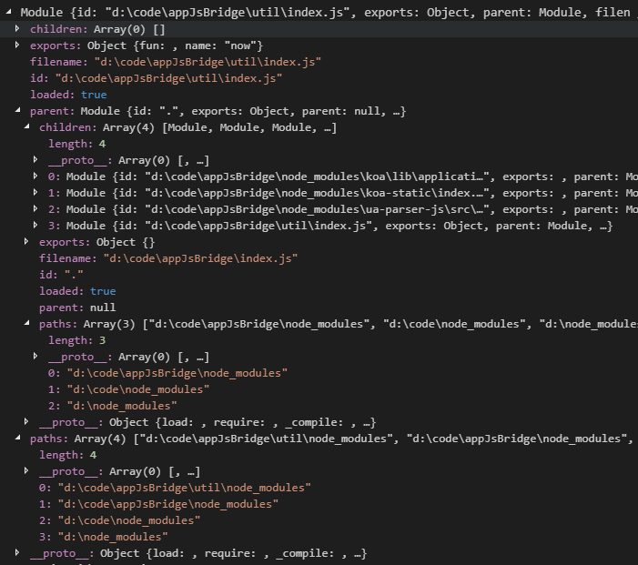
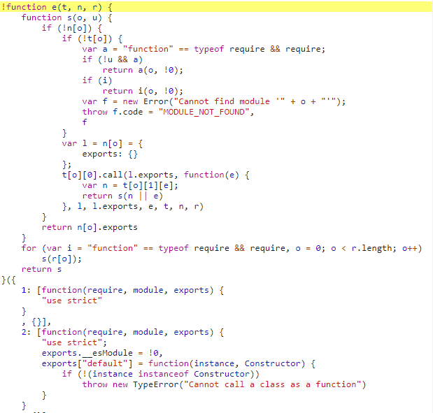

先说说什么是模块化，就是独立的功能代码封装成一个独立的模块，独立的文件，其他模块需要使用，在进行引用。

模块化有利于代码的拆分和架构上的解耦，模块化在服务端领域已经早已成熟，nodejs 也实现了模块化。

而在浏览器上，js 脚本是异步载入的，脚本按照编码顺序依次执行，依赖关系只能按照编码顺序来控制。因此前端早早就有了模块化技术，可每天醒来前端就多一个名词多一个框架的，发展实在迅猛，就前端模块化这些年的积累就有好几种，我们依次来看看。

### commonjs
先看伴随 nodejs 而诞生的 commonjs 规范。
commonjs 规范应用于 node 应用中，在 node 应用中每个文件就是一个模块，拥有自己的作用域，文件中的变量、函数都是私有的，与其他文件相隔离。

CommonJS规范规定，每个模块内部， module 变量代表当前模块。这个变量是一个对象，它的 exports 属性（即 module.exports ）是对外的接口。加载某个模块，其实是加载该模块的 module.exports 属性。（引用阮一峰老师的描述）

举个栗子看看模块化的文件该这么写

```JavaScript
// util\index.js
let name = 'now';
let age = 18;

let fun = () => {
    console.log('into fun');
    name = 'change'
}

module.exports = {
    name,
    fun
}
console.log(module)

// appJsBridge\index.js
var { name, fun } = require('./util/index.js')

```
上面这个文件有两个变量，一个函数，通过 module.exports 暴露变量 name 和函数 fun ,age 这个变量就是私有的，外部无法直接访问，如果想让 age 变量全局都可以访问，那么可以改成 global.age = 18，但这样子会污染全局作用域，会导致意想不到的惊喜（吓）。

我们看看 util\index.js 打印出来的 module


module 中有这些属性

> module.id 模块的识别符，通常是带有绝对路径的模块文件名。
>module.filename 模块的文件名，带有绝对路径。
>module.loaded 返回一个布尔值，表示模块是否已经完成加载。
>module.parent 返回一个module对象，表示调用该模块的模块，如果改该模块没有被引用，那么 parent 就是 null
>module.children 返回一个module数组，表示该模块要用到的其他模块。
>module.exports 表示模块对外输出的值。
>module.paths 这个用于 require 查找该文件的位置

在开发中我们常使用的就是 module.exports ， 通过 module.exports 输出的对象就是引用方 require 出来的值

#### require
既然有 module.exports 导出，那么就有与之相对应的 require 导入，如下

`var { name, fun, object } = require('./util/index.js') // 不用解构，直接导出对象也可以` 
使用 require 我们最关心的就是文件路径，这里还是引用阮一峰老师的解释

根据参数的不同格式，require命令去不同路径寻找模块文件。

1. 如果参数字符串以“/”开头，则表示加载的是一个位于绝对路径的模块文件。比如，require('/home/marco/foo.js')将加载/home/marco/foo.js。

2. 如果参数字符串以“./”开头，则表示加载的是一个位于相对路径（跟当前执行脚本的位置相比）的模块文件。比如，require('./circle')将加载当前脚本同一目录的circle.js。

3. 如果参数字符串不以“./“或”/“开头，则表示加载的是一个默认提供的核心模块（位于Node的系统安装目录中），或者一个位于各级node_modules目录的已安装模块（全局安装或局部安装）。大家还记得 module.paths 吧，这里就派上用场了。

举例来说，脚本/home/user/projects/foo.js执行了require('bar.js')命令，Node会依据 module.paths 路径加上文件名称，依次搜索。
这样设计的目的是，使得不同的模块可以将所依赖的模块本地化。

4. 如果参数字符串不以“./“或”/“开头，而且是一个路径，比如require('example-module/path/to/file')，则将先找到example-module的位置，然后再以它为参数，找到后续路径。

5. 如果指定的模块文件没有发现，Node会尝试为文件名添加.js、.json、.node后，再去搜索。.js件会以文本格式的JavaScript脚本文件解析，.json文件会以JSON格式的文本文件解析，.node文件会以编译后的二进制文件解析。所以文件名的后缀可以省略。

6. 如果想得到require命令加载的确切文件名，使用require.resolve()方法。

#### module.exports 和 exports

我们还可以导出 exports 直接使用，但需要注意一点，exports 是已经定义的常量，在导出的时候不能在给它定义，如下
```javascript
let exports = module.exports // 错误 #region exports  Identifier 'exports' has already been declared
exports = module.exports; // 正确的
```
使用 exports 我们可以这么导出对象，但需要注意一点，在导出对象前不能修改 exports 的指向，若修改 exports 就与 module.exports 不是一个东西了，当然你可以在导出对象后随意修改，这时候就不会影响导出。

```javascript
exports = module.exports
// exports = ()=>{} 不能修改
exports.fun = () => {
    console.log('into fun');
    name = 'change'
}
exports.name = 'now';
// exports = ()=>{} 随你改
```
单独使用 exports 和 module.exports 其实没啥区别，个人建议还是使用 module.exports ，毕竟这才是常规稳妥的写法。

#### 隔离性
模块化导出的对象与原本模块中的对象是隔离的，简单的说就是克隆了一份。看下面这个栗子
```javascript
// util\index.js
let object = {
    age: 10
}
let fun = function() {
    console.log('modules obj', object);
    object = { age: 99 }
}
module.exports = {
    fun,
    object
}

// index.js
var { name, fun, object } = require('./util/index.js')
console.log('before fun', object)
fun()
console.log('end fun', object)
```
执行 node index.js 看看打印

```javascript
before fun { age: 10 }
modules obj { age: 10 }
end fun { age: 10 }
```

引用方调用了导出的 fun 方法，fun 方法改变了模块中的 object 对象，可是在 index.js 中导出的 object 对象并没有发生改变，所以可见 commonjs 规范下模块的导出是深克隆的。

#### 在浏览器中使用 commonjs 规范 browserify
因为浏览器中缺少 module exports require global 这个四个变量，所以在浏览器中没法直接使用 commonjs 规范，非要使用就需要做个转换，使用 browserify ，它是常用的 commonjs 转换工具，可以搭配 gulp webpack 一起使用。看下经过 browserify 处理后的代码，就截取了些关键部分




我把核心代码复制出来，大致的结构如下，browserify 给每一个模块都设置了一个唯一 id ，通过模块路径来映射模块id，以此来找到各个模块。、

原本模块中的代码被有 require module exports 这三个参数的函数所包裹，其中 require 用来加载其他模块，exports 用来导出对象。

```javascript
!function e(t, n, r) {
    function s(o, u) {
        if (!n[o]) {
            if (!t[o]) {
                var a = "function" == typeof require && require;
                if (!u && a)
                    return a(o, !0);
                if (i)
                    return i(o, !0);
                var f = new Error("Cannot find module '" + o + "'");
                throw f.code = "MODULE_NOT_FOUND",
                f
            }
            var l = n[o] = {
                exports: {}
            };
            t[o][0].call(l.exports, function(e) {
                var n = t[o][1][e];
                return s(n || e)
            }, l, l.exports, e, t, n, r)
        }
        return n[o].exports
    }
    for (var i = "function" == typeof require && require, o = 0; o < r.length; o++)
        s(r[o]);
    return s
}({
    1:[function(require, module, exports) {
        "use strict"
    },{"babel-runtime/helpers/classCallCheck": 2},[3,4]},
    2: [function(require, module, exports) {
        "use strict";
        exports.__esModule = !0,
        exports["default"] = function(instance, Constructor) {
            if (!(instance instanceof Constructor))
                throw new TypeError("Cannot call a class as a function")
        }
    }
    , {}]
},{},[])
```


### ES6 模块化
ES6 ，ECMA推出了官方标准的模块化解决方案，使用 export 导出，import 导入，编码简洁，从语义上更加通俗易懂。

ES6 的模块不是对象，而是在编译的时候就完成模块的引用，所以是编译时加载的。它是异步加载模块

个人认为，ES6模块化是以后的主流。

还是上面的栗子，用ES6模块化改写，改动上并不大，几个关键字做下修改即可
```javascript
// util/index.js
let name = 'now';

let fun = () => {
    name = 'change'
}

export {
    name,
    fun
}
// app.js
import { name, fun } from "../util";
console.log('before fun', object)
fun()
console.log('end fun', object)
```

#### 浏览器中使用
但是ES6模块化在浏览器上的支持并不是很好，大部分浏览器还是不支持，所以需要做转换

1. 不使用 webpack ，使用 gulp 等构建流工具，那么我们需要使用babel将 es6 转成 es5 语法

使用 babel 转换，在babel 配置文件 .babelrc 写上
```javascript
{
"presets": ["es2015"]
}
```

在使用 browserify 对模块进行转换

2. 若使用 webpack ，webpack 是支持 es6 模块化的，所以就只要引用 babel-loader ，对 es6 的语法做处理即可

#### 模块的导出是对象的引用
ES6模块化下的导出是对象的引用，我们看下面这个栗子
```javascript
// util/index.js
let name = 'now';

let fun = () => {
    name = 'change';
}
let getName = function() {
    console.log('module:',name)
}

export {
    name,
    fun,
    getName
}
// app.js
import { name, fun, getName } from "../util";
console.log("before fun:", name);
fun();
console.log("after fun:", name);
name = "change again";
getName();
```

我们看看输出
```javascript
before fun: now
after fun: change
module: change
```
可见，模块内部函数改变了模块内的对象，外部导出使用的对象也跟着发生了变化，这一点是和 commonjs 规范区别最大的地方，这个特性可用于状态提升。

#### ES6 模块规范和 commonjs规范 运行机制的区别
CommonJS 模块是运行时加载，ES6 模块是编译时输出接口

- 运行时加载: CommonJS 模块就是对象；即在输入时是先加载整个模块，生成一个对象，然后再从这个对象上面读取方法，这种加载称为“运行时加载”。

- 编译时加载: ES6 模块不是对象，而是通过 export 命令显式指定输出的代码，import时采用静态命令的形式。即在import时可以指定加载某个输出值，而不是加载整个模块，这种加载称为“编译时加载”。

CommonJS 加载的是一个对象（即module.exports属性），该对象只有在脚本运行完才会生成。而 ES6 模块不是对象，它的对外接口只是一种静态定义，在代码静态解析阶段就会生成。

### AMD-require.js 和 CMD-sea.js
AMD和CMD这两个规范都离不开 require.js 和 sea.js，早些年，为了解决异步加载模块而诞生的方案。

AMD规范的模块化：用 require.config()指定引用路径等，用define()定义模块，用require()加载模块。

CMD规范的模块化：用define()定义模块， seajs.use 引用模块。

具体的介绍的可以看[这一篇](https://juejin.im/post/5aaa37c8f265da23945f365c#heading-5)，写的非常详细。


### 插件对模块兼容处理
我们开发插件时可能需要对各种模块做支持，我们可以这么处理

```JavaScript
const appJsBridge = function(){};
if ("function" === typeof define) {
    // AMD CMD
    define(function() {
        return appJsBridge;
    })
} else if ("undefined" != typeof exports) {
    // commonjs
    module.exports = appJsBridge;
} else {
    // 没有模块化
    window.appJsBridge = appJsBridge;
}
```


### 参考链接
http://javascript.ruanyifeng.com/nodejs/module.html#toc2
http://www.ruanyifeng.com/blog/2015/05/commonjs-in-browser.html
https://juejin.im/post/5aaa37c8f265da23945f365c#heading-5