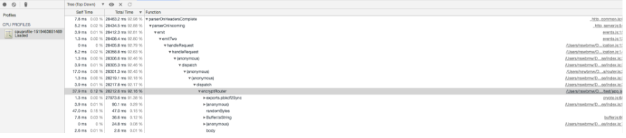

上周在系统上线前，为了看下系统能承受多大的并发和并发下的负载情况，进行了一轮压测。在压测过程中，发现服务器的cpu飚的的非常高，而tps，接口耗时、服务可用等都是正常的，卧槽，这就奇了怪了，自己想了半天也没想出为啥，不得已求助了大佬，大佬说先查看 `cpu processor` ,what?这是啥？？虽然听不懂，但可以查嘛╭(╯^╰)╮，还没等我查出来，大佬直接上手，一顿骚操作，便找出了原因~ 这着实让自己汗颜啊，内功远远不足啊，回来网上找了资料，恶补一把如何分析node工程中的性能问题

在开发过程中，因为过于只关注了业务逻辑的实现，一些可能出现性能的点被忽略掉，而且这些点只能在量稍微大些的并发场景下才会出现，忘了在哪看到一句话 `可能会出问题的点，便一定会出问题。`  性能问题进行分析必不可少

### 样例项目
为了便于演示，写了个简单的小例子
```javascript
// app.js
const crypto = require('crypto')
const Koa = require('koa')
const Router = require('koa-router');

const app = new Koa();
const router = new Router();

router.get('/crypto', async(ctx, next) => {
    const salt = crypto.randomBytes(128).toString('base64')
    const hash = crypto.pbkdf2Sync('crypto', salt, 10000, 64, 'sha512').toString('hex')

    ctx.body = { hash: hash }
    console.log(hash)

    ctx.status = 200
    next()
});

let reqNum = 0
router.get('/empty', async(ctx, next) => {

    ctx.body = { hash: 'empty' }
    reqNum++;

    ctx.status = 200
    next()
});

app.use(router.routes()).use(router.allowedMethods());
app.listen(3000, () => {
    console.log("listen 3000")
})
```
基于koa2，有两个路由，一个`/crypto`，其中的业务逻辑是，使用crypto库对字符串加密；一个是 `/empty`，没有业务逻辑的接口，就是个空接口

### 压力测试
压力测试工具市面上有很多种，就不一一列举了，在社区看到有人推荐 [autocannon](https://github.com/mcollina/autocannon) ，就对这个工具做个介绍，官方的简介是 `fast HTTP/1.1 benchmarking tool written in Node.js` ，使用node编写的压测工具，能比wrk生成更多负载。

#### install
`npm i autocannon -g `
`npm i autocannon --save`

#### use
提供两种使用方式
1. 命令行 `autocannon -c 100 -d 5 -p 2 http://127.0.0.1:3000/test` 简单快速
2. api调用 `autocannon(opts[, cb])` 便于编写脚本

关键参数有这么几个
- `-c/--connections NUM` 并发连接的数量，默认10
- `-p/--pipelining NUM` 每个连接的流水线请求请求数。默认1
- `-d/--duration SEC` 执行的时间，单位秒
- `-m/--method METHOD` 请求类型 默认GET
- `-b/--body BODY` 请求报文体
还有很多参数，大家可以查看官网文档

#### report
下图是对 `/empty` 接口压测 `autocannon -c 100 -d 5 -p 1 http://127.0.0.1:3000/empty` 结果如下


可看到，每秒有100个链接，每个链接一个请求，持续5秒，一共产生 31k 次请求。
报告分三部分，第一行表示接口的延迟，第二行表示每秒的请求数(tps)，第三行表示每秒返回的字节数。那么，延迟越低，tps越高，就表示接口性能越好，因为empty 是个空接口，所以它的tps=6221还不错，响应时间也很快，我们换成 `/crypto` 接口在试试


立马看出差距了，这个接口tps只有77，接口耗时达到了1100ms，说明这个接口有很大的优化空间啊

### 生成性能文件与分析
通过压测工具我们找到了有问题的接口，那接下来，就要对接口进行剖析了，可是光看接口代码，不好分析啊，毕竟没有说服力，我们就需要一份性能报告，用数据说话，下面介绍这个两个方法给大家

#### V8 Profiler
V8 官方已经为大家考虑到这点了，提供了[Profiler工具](https://github.com/v8/v8/wiki/V8-Profiler) 使用方式也很快捷，步骤如下(以app.js为例)
1. 在启动命令中加上 --prof ，如 `node --prof app.js` ,在项目根目录会生成`isolate-xxxxxxx-v8.log`格式的文件，用来记录运行期间的调用栈和时间等信息，其中内容如下（文件较大，就截取最顶端一小截）
```
v8-version,6,1,534,47,0
shared-library,"C:\Program Files\nodejs\node.exe",0x7ff7505f0000,0x7ff751c0f000,0
shared-library,"C:\WINDOWS\SYSTEM32\ntdll.dll",0x7ff8718a0000,0x7ff871a61000,0
shared-library,"C:\WINDOWS\system32\KERNEL32.DLL",0x7ff870590000,0x7ff87063d000,0
shared-library,"C:\WINDOWS\system32\KERNELBASE.dll",0x7ff86e830000,0x7ff86ea18000,0
shared-library,"C:\WINDOWS\system32\WS2_32.dll",0x7ff86ee00000,0x7ff86ee6b000,0
```

2. 对刚刚生成的log文件分析，还是使用官方提供的工具 `node --prof-process isolate-xxxxxxxx-v8.log`，生成结果如下(去掉无用的部分)
```
Statistical profiling result from isolate-00000209B99A60A0-v8.log, (17704 ticks, 8 unaccounted, 0 excluded).

 [Shared libraries]:
   ticks  total  nonlib   name
  13795   77.9%          C:\WINDOWS\SYSTEM32\ntdll.dll
  ...

 [JavaScript]:
   ticks  total  nonlib   name
     12    0.1%   11.3%  Builtin: CallFunction_ReceiverIsAny
     ...

 [C++]:
   ticks  total  nonlib   name

 [Summary]:
   ticks  total  nonlib   name
     94    0.5%   88.7%  JavaScript
      0    0.0%    0.0%  C++
      8    0.0%    7.5%  GC
  17598   99.4%          Shared libraries
      8    0.0%          Unaccounted

 [C++ entry points]:
   ticks    cpp   total   name

 [Bottom up (heavy) profile]:
  Note: percentage shows a share of a particular caller in the total
  amount of its parent calls.
  Callers occupying less than 1.0% are not shown.

   ticks parent  name
  13795   77.9%  C:\WINDOWS\SYSTEM32\ntdll.dll

   3795   21.4%  C:\Program Files\nodejs\node.exe
   3768   99.3%    C:\Program Files\nodejs\node.exe
   3287   87.2%      Function: ~pbkdf2 crypto.js:633:16
   3287  100.0%        Function: ~exports.pbkdf2Sync crypto.js:628:30
   3287  100.0%          Function: ~router.get D:\github\webapp\js\usen\app.js:8:23
   3287  100.0%            Function: ~dispatch D:\github\webapp\js\usen\node_modules\_koa-compose@3.2.1@koa-compose\index.js:37:23
    ...
```
报告包含六部分：Shared libraries、JavaScript、C++、Summary、C++ entry points 和 Bottom up (heavy) profile，[JavaScript] 部分列出了 JavaScript 代码执行所占用的 CPU ticks（CPU 时钟周期），[C++] 部分列出了 C++ 代码执行所占用的 CPU ticks，[Summary] 列出了各个部分的占比，[Bottom up] 列出了所有 CPU 占用时间从大到小的函数及堆栈信息。

根据 `3287   87.2%      Function: ~pbkdf2 crypto.js:633:16` 可看出这个函数消耗了 87.2% 的cpu

3. 文件的方式不直观，那我们换个UI界面的，步骤如下
- 先clone v8的仓库下来 `git clone https://github.com/v8/v8.git`
- 将日志文件转换成 json格式 `node --prof-process --preprocess isolate-xxxxxxxxxx-v8.log > v8.json`
- 打开 `v8/tools/profview/index.html` 文件，是个静态界面，在界面中心选择刚生成的 v8.json文件，文件解析成功后，界面如下


具体的功能就不一一解释啦，我们逐层展开，寻找耗时的点，很快便找到耗cpu的地方，如下图


node占比是45%，其中 `pbkdf2 crypto.js`便占用了92%

#### v8-profiler
除了官方提供之外，我们还可以选择开源大佬的库，[v8-profiler](https://github.com/node-inspector/v8-profiler) ，这个库的创建的时间比较早，6年前便创建了，最近一次更是在一年半前，社区评价还是不错的

#### 生成报告
生成方式很简单，不足的是，需要硬编码在项目中，如下

```javascript
profiler.startProfiling('', true);
setTimeout(function() {
  var profile = profiler.stopProfiling('');
  profile.export()
     .pipe(fs.createWriteStream(`cpuprofile-${Date.now()}.cpuprofile`))
     .on('finish', () => profile.delete())
}, 1000);
```
#### 解析报告

##### Chrome
我们的大Chrome要出马啦，在Chrome的控制台，有一栏 `JavaScript Profile` 如下图


点击load，选择刚刚生成的文件，解析后如下



逐层查看，便了然

#### flamegraph-火焰图
使用 [flamegraph](https://github.com/brendangregg/FlameGraph) 生成酷炫的火焰图，用在报告那是酷炫的一逼，官网图如下


使用方式就不细说啦

#### v8-analytics
这个是社区大佬么们，写的一个开源库 [v8-analytics](https://github.com/hyj1991/v8-analytics/blob/master/README_ZH.md)，官方介绍如下

解析v8-profiler和heapdump等工具输出的cpu & heap-memory日志，可以提供

- v8引擎逆优化或者优化失败的函数标红展示以及优化失败原因展示
- 函数执行时长超过预期标红展示
- 当前项目中可疑的内存泄漏点展示

对应的命令如下
`va test bailout --only` 这个命令可以只把那些v8引擎逆优化的函数列出来展示。

`va test timeout 200 --only` 这个命令可以只把那些执时长超过200ms的函数列出来展示。

`va test leak` 可疑展示出测试的heapsnapshot文件中可疑的内存泄漏点。

这个库的好处是，省的我们一个个去点开查找，这样可以更加便于我们筛选问题啦~

### 小结
> 我是github的搬运工
以上的方法基本上能满足我们的需求，当然性能涉及的方方面面很多比如内存泄漏、事物等，性能调优路漫漫呀，
文章大部分东西都是来自大佬们的总结，我只是在做一次整理汇总，便于自己理解与查阅，希望能帮到小伙伴们~

### 参考链接

https://github.com/nswbmw/node-in-debugging/blob/master/1.2%20v8-profiler.md

https://github.com/hyj1991/v8-analytics/blob/master/README_ZH.md

https://cnodejs.org/topic/58b562f97872ea0864fee1a7

https://github.com/mcollina/autocannon

https://www.helplib.com/GitHub/article_140577

https://github.com/nearform/node-clinic
