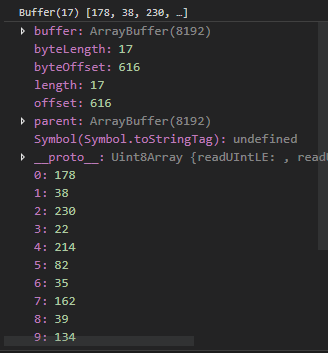

### Buffer 介绍
javascript 中对数据处理都是以字符串的形式，而对于二进制数据就不便于处理，所以 `Buffer` 便是用于读取或操作二进制数据都对象。

一句话概括： `Buffer` 类是一个全局变量，用于直接处理二进制数据，提供工具类方法。

官网上关于 `Buffer` 解释的非常清楚，所以就不再拷贝官网，这里列举一些使用较为频繁的场景。

### 对象转换成Buffer
在操作文件或者IO的场景中，我们需要将对象转换成二进制数据流。

引用官方文档
- Buffer.from(array) 返回一个新的 Buffer，其中包含提供的八位字节数组的副本。

- Buffer.from(arrayBuffer[, byteOffset [, length]]) 返回一个新的 Buffer，它与给定的 ArrayBuffer 共享相同的已分配内存。

- Buffer.from(buffer) 返回一个新的 Buffer，其中包含给定 Buffer 的内容的副本。

- Buffer.from(string[, encoding]) 返回一个新的 Buffer，其中包含提供的字符串的副本。

- Buffer.alloc(size[, fill[, encoding]]) 返回一个指定大小的新建的的已初始化的 Buffer。 此方法比 Buffer.allocUnsafe(size) 慢，但能确保新创建的 Buffer 实例永远不会包含可能敏感的旧数据。

- Buffer.allocUnsafe(size) 和 Buffer.allocUnsafeSlow(size) 分别返回一个指定大小的新建的未初始化的 Buffer。 由于 Buffer 是未初始化的，因此分配的内存片段可能包含敏感的旧数据。

栗子如下
```javascript
const obj = {
    name:'test'
}
const buffer = Buffer.from(JSON.stringify(obj),'utf8') //  默认编码是 utf8 
```

### Buffer 对象转换成其它机制的字符串
我们可以看到 `Buffer` 对象是一个 `Uint8Array` 的实例，所以我们可以使用迭代器获取 `Buffer` 中数组的值。



1. `Buffer` 对象转二进制字符串，便利获取到数组中的值，通过 `Number.toString(radix)` 方法，将整形转换成二进制字符串，最后将各个数值的二进制字符串拼接起来即可。但为了后续对二进制操作方便，所以我们约定好二进制的长度，因为 `Buffer` 数组是在 0 到 255 之间的整数数组，255 的二进制是 8 位，所以我们在转换过程中把不足八位的前置补零，当然这还是得看具体的场景.
```javascript
bytesToBinary(bytes) {
    const length = bytes.length;
    let result = '';
    for (let i = 0; i < length; i++) {
        const binStr = Number(bytes[i]).toString(2)
        result +=  '0'.repeat(8 - binStr.length) + binStr; // 不足八位前置补0
    }
    return result.toString();
}
```

2. Buffer转成 16 进制也是类似，如下
```javascript
bytesToBinary(bytes) {
    const length = bytes.length;
    let result = '';
    for (let i = 0; i < length; i++) {
        const binStr = Number(bytes[i]).toString(16)
        result +=  '0'.repeat(2 - binStr.length) + binStr; // 不足二位前置补0
    }
    return result.toString();
}
```

### 小结
关于 `Buffer` 的介绍网上有很多文章，但我觉得都不如官网写的清晰，所以建议大家直接看文档。


后续会继续补充在工作中遇到与 `Buffer` 相关的使用场景，毕竟工具类函数只有在具体场景下分析才更有价值。