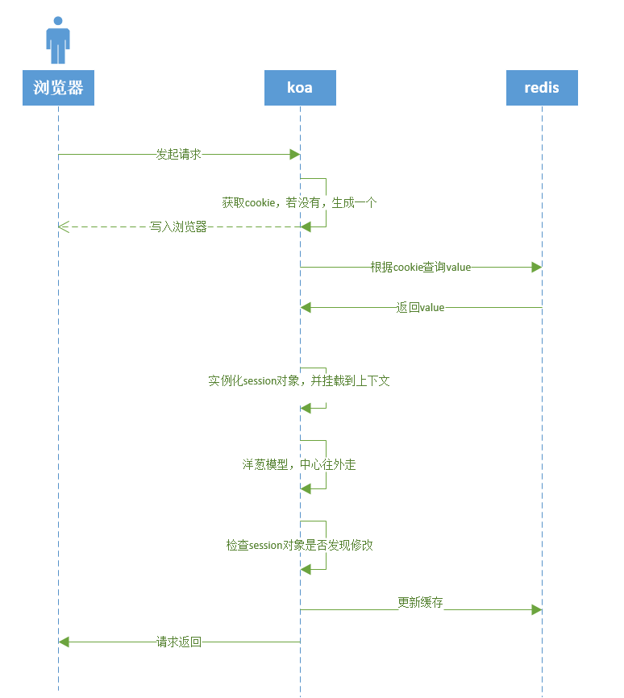
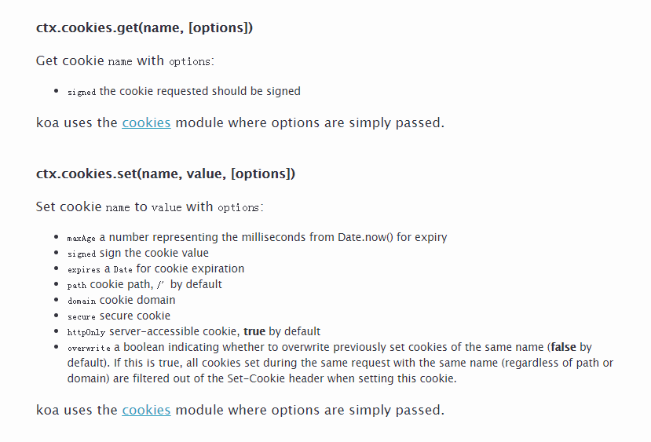

我们公司的大佬 串串，搭建了一套基于koa2的node框架，虽然说是重复造轮子，但适用当前场景的轮子才是最好的，何况很多人还造不出轮子呢~ 大佬搭建的框架命名为 `Sponse`，其中有很多出色的设计，这里对 `session` 的设计做个总结（其实是为了自己加深印象，学习大佬的设计）

> Sponse意思是海绵，而我们这套框架就如同海绵一样，通过不断吸收其他框架的优秀设计丰满自己

### cookie 与 session
做开发的小伙伴对这两个应该在熟悉不过了，这两个一起构建起前后端状态的联系，常见的如维护用户登录状态，用户登录后，需要在服务端记录下该用户的登录状态，前端才可以使用需要登录态的接口，此时，浏览器中的 `cookie` 就是查询用户是否登录的凭证，在服务端，通常是将用户状态信息存储在缓存中，简单说，就是基于 `cookie的session` 

### 调用方式
> 优秀的架构中，调用方式必须是友好的

期望能够通过上下文直接调用，如：获取session对象 `ctx.session` ; 设置session的值 `ctx.session.name = name`

### 逻辑图

整体实现逻辑如下



### 实现

1. koa提供了操作cookie的api，开箱即用，官方截图如下



2. 缓存基于redis实现

详细代码如下：

#### Session 对象
首先构建一个session对象

核心方法：
1. `save` 用于同步cookie
2. `changed` 用于检测session对象是否发生修改，为了同步更新缓存中的值

```
export class Session {
    private _ctx;
    isNew: boolean;
    _json; // session对象的json串，用于比较session对象是否发生变化

    constructor(ctx, obj) {
        this._ctx = ctx;
        if (!obj) this.isNew = true;
        else {
            for (const k in obj) {
                this[k] = obj[k];
            }
        }
    }

    /**
     * Save session changes by
     * performing a Set-Cookie.
     *
     * @api private
     */
    save() {
        const ctx = this._ctx;
        const json = this._json || JSON.stringify(this.inspect());
        const sid = ctx.sessionId;
        const opts = ctx.cookieOption;
        const key = ctx.sessionKey;

        if (ctx.cookies.get(key) !== sid) {
            // 设置cookies的值
            ctx.cookies.set(key, sid, opts);
        }
        return json;
    };

    /**
     * JSON representation of the session.
     *
     * @return {Object}
     * @api public
     */
    inspect() {
        const self = this;
        const obj = {};

        Object.keys(this).forEach(function (key) {
            if ('isNew' === key) return;
            if ('_' === key[0]) return;
            obj[key] = self[key];
        });

        return obj;
    }

    /**
     * Check if the session has changed relative to the `prev`
     * JSON value from the request.
     *
     * @param {String} [prev]
     * @return {Boolean}
     * @api private
     */
    changed(prev) {
        if (!prev) return true;
        this._json = JSON.stringify(this.inspect());
        return this._json !== prev;
    };

}
```

#### SessionEngine koa中间件

koa 当然是离不开中间件了，洋葱模型酷炫到不行，非常方便的解决了session对象与缓存的同步

```
decorator(app) {
    app.keys = ['signed-key'];
    const CONFIG = {
        key: app.config.name + '.sess', /** (string) cookie key (default is koa:sess) */
        cookie: {
            // maxAge: 1000, /** (number) maxAge in ms (default is 1 days) */
            overwrite: false, /** (boolean) can overwrite or not (default true) */
            httpOnly: true, /** (boolean) httpOnly or not (default true) */
            signed: true, /** (boolean) signed or not (default true) */
        }
    };

    app.use(async (ctx, next) => {
        let sess: Session;
        let sid;
        let json;

        ctx.cookieOption = CONFIG.cookie;
        ctx.sessionKey = CONFIG.key;
        ctx.sessionId = null;
        // 获取cookie 对应的值， 即sessionID，就是缓存中的key
        sid = ctx.cookies.get(CONFIG.key, ctx.cookieOption);
        // 获取session值
        if (sid) {
            try {
                // 若key存在，则从缓存中获取对应的值
                json = await app.redisClient.get(sid);
            } catch (e) {
                console.log('从缓存中读取session失败： %s\n', e);
                json = null;
            }
        }

        // 实例化session
        if (json) {
            // 若缓存中有值，则基于缓存中的值构建session对象
            ctx.sessionId = sid;
            try {
                sess = new Session(ctx, json);
            } catch (err) {
                if (!(err instanceof SyntaxError)) throw err;
                sess = new Session(ctx, null);
            }
        } else {
            sid = ctx.sessionId = sid || Uuid.gen();
            sess = new Session(ctx, null);
        }

        // 为了便于使用，将session挂载到上下文，这样就可以 ctx.session 这么使用了
        Object.defineProperty(ctx, 'session', {
            get: function () {
                return sess;
            },
            set: function (val) {
                if (null === val) return sess = null;
                if ('object' === typeof val) return sess = new Session(this, val);
                throw new Error('this.session can only be set as null or an object.');
            }
        });

        try {
            await next();
        } catch (err) {
            throw err;
        } finally {
            if (null === sess) {
                // 设置session=null表示清空session
                ctx.cookies.set(CONFIG.key, '', ctx.cookieOption);
            } else if (sess.changed(json)) {
                // 检查 session 是否发生变化，若有变化，更新缓存中的值
                json = sess.save();
                await app.redisClient.set(sid, json);
                app.redisClient.ttl(sid);
                // 设置redis值过期时间为60分钟
                app.redisClient.expire(sid, 7200);
            } else {
                // session 续期
                app.redisClient.expire(sid, 7200);
            }
        }
    });
```

### 小结
多多学习~ 点点进步~


