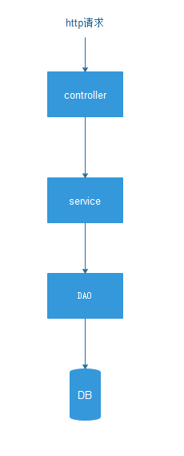

> 题图 挺胸向前走加油鸭

最近在做项目，遇到个纠结的问题，项目该如何分层？
大部分项目通常会有 `controller` `service也称(business)` `DAO`这三层，接口请求流转如下

一个接口逻辑通常由以下几部分组成，权限校验、参数校验、业务编排、数据库操作、缓存操作、第三方服务调用，那么问题来了，这些操作都应该放在那一层呢？

在接手老项目的时候，会发现，大家写法都很有自己的个性，有的小伙伴喜欢将业务编排放在`controller`，也有的喜欢放在`service`，有的会按照前辈的写法，还有的随心情，那舒服就放哪，百花齐放，这就会造成一个问题，随着项目越来越大，业务将散落在各个层级，代码冗余量增多，相同的功能出现多种写法，这对后续的维护和扩展简直就是无底大坑。

好的分层应该满足一下几点：
1. 层级分明，职责分明
2. 链路清晰，避免环形调用
3. 良好的抽象和复用
4. 业务接口足够独立，一个接口的修改不会影响其他功能

### 目前的纠结
权限校验、参数校验、业务编排、数据库操作、缓存操作、第三方服务调用，这几部分，权限校验、参数校验自然是放在`controller`，就像个门卫，将不合法的直接打回；数据库操作自然是放在`DAO`层，那么业务编排、缓存操作、第三方服务调用这几部分该在哪里呢？

#### 尝试一
将业务编排放在`controller`，缓存操作、服务调用等放在`service`，与`DAO`层的调用也放在`service`层

好处：业务逻辑会比价清晰，很多数据、服务都通过`service`层一个函数调用，`controller`中的代码量也会少很多
坏处：一个业务接口的逻辑，会散落在`controller`和`service`，业务逻辑相对较分散；由于`controller`中大量调用`service`中方法，导致一个`service`中的方法可能被多个`controller`调用，导致本来不相干的业务接口出现了交集，对后续的维护和扩展，留下了隐患

#### 尝试二
将业务编排都放在`service`中处理，`controller`权限和参数校验通过后，就直接调用`service`

好处：业务处理集中在`service`中，`controller`仅负责门卫
坏处：为避免环形调用，所以`service`间不能互相调用 `service`层的方法，这一限制，导致`services`没法很好的抽象和复用，当某一块业务越来越庞大的时候，对应的`services`就显得臃肿了

### 阿里巴巴开发规范
为此找了阿里巴巴公开的Java开发手册，阿里作为世界一流的大厂，它的标准是非常不错的，哈哈，反正我是这么觉得，虽然我们是node项目，但设计思想是通用的

> 因截图在移动端看不清，所以直接引用阿里开发文档

(一) 应用分层

1.【推荐】图中默认上层依赖于下层，箭头关系表示可直接依赖，如：开放接口层可以依赖于
Web 层，也可以直接依赖于 Service 层，依此类推：

- 开放接口层：可直接封装 Service 方法暴露成 RPC 接口；通过 Web 封装成 http 接口；进行网关安全控制、流量控制等。
- 终端显示层：各个端的模板渲染并执行显示的层。当前主要是 velocity 渲染，JS 渲染，JSP 渲染，移动端展示等。
- Web 层：主要是对访问控制进行转发，各类基本参数校验，或者不复用的业务简单处理等。
- Service 层：相对具体的业务逻辑服务层。
- Manager 层：通用业务处理层，它有如下特征：
        1）对第三方平台封装的层，预处理返回结果及转化异常信息；
        2）对 Service 层通用能力的下沉，如缓存方案、中间件通用处理；
        3）与 DAO 层交互，对多个 DAO 的组合复用。
- DAO 层：数据访问层，与底层 MySQL、Oracle、Hbase 等进行数据交互。
- 外部接口或第三方平台：包括其它部门 RPC 开放接口，基础平台，其它公司的 HTTP 接口。

> 以上内容为引用阿里开发文档

开放接口层和请求处理层，可以理解为我们的`controller`层，作用是RPC和http接口封装、安全流量控制、访问控制转发、参数校验和不复用的业务简单处理。

`services`层，用于处理具体的业务逻辑。

`manager`层，通用业务处理层，即`services`层的沉淀抽象，如缓存方案、中间件处理、第三方服务封装等，这一层可以服务于多个`services`

阿里的这个分层结构，我认为是比较清晰明了的，与比较自己的项目一比较，便发现自己项目少了`manager`这一层，根据阿里规范，我们进行层级优化~

### 层级优化
我们在`尝试二`的基础上加上`manager`层，变为如下

1. `controller`: 不在编写业务逻辑，仅处理权限、参数等校验的工作,这一层的职责就是校验合法性
2. `services`: 编写具体业务的实现，这一层的大部分方法不具有复用性，为了防止互相影响和便于后期维护和扩展，所以方法应尽量保持相互独立，同时，考虑到这一层的代码量会随着业务扩展而不断增多，所以`services`需要根据情况进行适当的功能模块拆分，要避免单文件过大，同时又要避免同一模块业务过于分散
3. `manager`: 对`services`层的业务沉底抽象，并服务于`services`层，将`services`层频繁出现的功能抽象出来，如缓存操作、第三方服务调用，这一层将领域处理的口子收敛

### 总结
有句话，技术是服务于业务的，脱离了业务，技术将没有任何价值。架构设计也如此，设计源于场景，每个阶段的场景皆不同，所以设计也是在不断的演变，经历一轮轮的研讨和重构后，才能诞生服务于业务的优秀架构。

层级的划分没有尽善尽美，适用于当前场景和未来可期的，适用于自己团队，提高团队生产力，那么就是最棒的~

作为一枚前端小白，在高大上架构设计领域，还未看见其门槛，还有很长的路要走呀，哈哈~  写的有问题的地方，还请大伙帮忙指正，欢迎大家一起探讨，一起进步~

> 向优秀的人学习，向优秀的人靠齐，加油ヾ(◍°∇°◍)ﾉﾞ

#### 参考文章

[领域驱动设计到底难在哪？](https://www.jianshu.com/p/ab80cb9f307c)

[你的项目应该如何正确分层？](https://juejin.im/post/5b44e62e6fb9a04fc030f216)

[阿里巴巴Java开发手册](https://github.com/alibaba/p3c/blob/master/%E9%98%BF%E9%87%8C%E5%B7%B4%E5%B7%B4Java%E5%BC%80%E5%8F%91%E6%89%8B%E5%86%8C%EF%BC%88%E8%AF%A6%E5%B0%BD%E7%89%88%EF%BC%89.pdf)