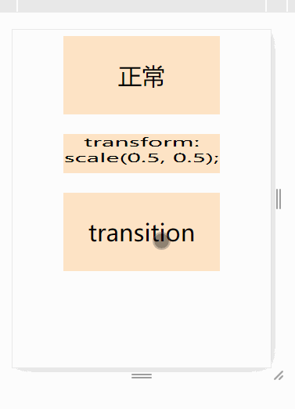

刚接触 css 的伙伴们，有时候会被 `transform translate transition` 给绕晕，因为它们长得是这么像，这篇用较短的篇幅给大家介绍，让大家更好的区分它们。

### transform
字面意思是：使…变形

属性的作用是对给定的元素旋转，缩放，平移或扭曲，通过修改元素的坐标空间实现。

使用方式：`transform: rotate | scale | skew | translate |matrix;`

所以当我们需要对元素做这些操作时，就需要使用 transform 属性。

### translate
大伙在 `transform` 的值中应该发现了 `translate` ， `translate` 的意思就是平移，将元素按照坐标轴上下左右移动

使用方式： `transform: translate(200px,50px);` 元素较原先的位置，往右移动 200px，往下移动 50px

注意， `translate` 属性需要在 `transform` 中才能使用， `translate` 其实也是属于修改元素的空间位置。 

### transition
字面翻译是过渡的意思，这个属性可以让元素的变化以动画的形式呈现，比如说过高度从100变到200
`height:100px -> 200px` ，没有其他属性的情况下，这个就是一瞬间的事，为了让页面交互友好些，希望高度的变化能有个过渡效果，那么 `transition` 就派上用场了。

官方介绍： `transition` 提供了一种在更改CSS属性时控制动画速度的方法，其可以让属性变化成为一个持续一段时间的过程。

`transition` 用来做动画效果非常的方便，但缺点也很明显，动画不支持循环，复杂的动画就难为它了，所以适用于一些简单的过渡效果。

它有四个值：
transition-property：指定属性用于生成过渡动画，如宽、高、颜色等等，包括上面介绍的 `transform` ，只要这个属性的值是可以变化就行，且起始状态都是明确的。

transition-duration：动画执行时间

transition-timing-function：缓动函数， 内置了这些 ease | linear | ease-in | ease-out | ease-in-out ，也可以上 [http://easings.net/](http://easings.net/) 挑选自己喜欢的效果

transition-delay：延迟执行的时间

### 三个一起使用
我们看下面这段 css，同时用上了我们刚介绍的三个属性，这段css的效果是，当鼠标移上元素的时候，元素在 200毫米内，匀速的往x轴和y轴放心移动了 100 像素。
```css
.translate:hover {
    transition: transform .2s ease;
    transform: translate(100px,100px);
}
```

效果如下



### 总结
`transform` 是用来实现元素坐标空间的变化， `translate` 用来移动元素， `transition` 给元素的变化加上动画效果。