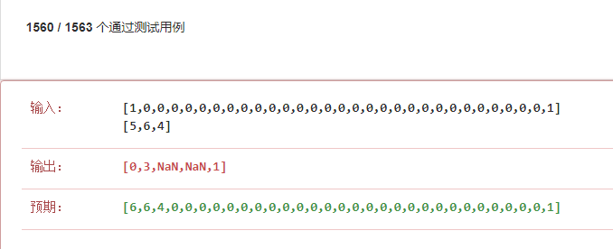

大部分玩前端的小伙伴，在算法上都相对要薄弱些，毕竟调样式、调兼容就够掉头发的了，哪还有多余的头发再去折腾。

确实在前端中需要使用到算法的地方是比较少，但若要往高级方向发展，算法的基本功就非常重要啦。对了，算法在面试中可是必考项啊，所以为了期望薪资，头发还是得做下牺牲呀。

有些小伙伴认为，刷了那些奇奇怪怪的算法题，可在工作中很少能直接派上用场，嗯，没错，所以学算法是件高延迟满足的事情。那么学算法，到底收获什么呢？我觉得通过练习算法，培养我们解决问题的潜意识才是最重要的。

学习算法，最直接有效的就是刷题，刷题有很多渠道，我比较推荐 LeetCode，它有国内和国外版，非常方便。现在网上有很多大牛都分享各自刷题的解法，但百读不如一练嘛，所以我也开个【来刷LeetCode】系列，由浅入深，分享我的解法和思路，因为我的解法肯定不是最棒的，所以还会在加上我觉得优秀的解法。

哔哔了这么多，我们现在开撸。代码略多，建议大家先点个赞（我就是来骗赞的~）

### 两数之和
两数之和，题目描述如下：

给定一个整数数组 nums 和一个目标值 target，请你在该数组中找出和为目标值的那 两个 整数，并返回他们的数组下标。
你可以假设每种输入只会对应一个答案。但是，你不能重复利用这个数组中同样的元素。

示例:
> 给定 nums = [2, 7, 11, 15], target = 9 <br>
因为 nums[0] + nums[1] = 2 + 7 = 9<br>
所以返回 [0, 1]

#### 我的思路
这题，最暴力的解法就是逐个循环查找，但时间复杂度是 n*n ，太暴力的不适合我们。
可以这么看，在遍历第一个值得时候，保留这个值与target的差，然后在下次遍历中，看看是不是与保留的差值相同，如果相同，那么就可以找到我们想要的结果了。画个简单的表格如下：

| 序号  | 当前值    |  差值  |
| ---- | ---- | ---- |
| 0  | 2  | 7  |
| 1  | 7 | 2  |

这样一来，就需要记录差值，散列表这一数据结构就排上用场了，来看看百科关于散列表的介绍：

> 散列表（Hash table，也叫哈希表），是根据关键码值(Key value)而直接进行访问的数据结构。也就是说，它通过把关键码值映射到表中一个位置来访问记录，以加快查找的速度。这个映射函数叫做散列函数，存放记录的数组叫做散列表。
给定表M，存在函数f(key)，对任意给定的关键字值key，代入函数后若能得到包含该关键字的记录在表中的地址，则称表M为哈希(Hash）表，函数f(key)为哈希(Hash) 函数。

而js中的对象就是基于哈希表结构，所以我们构造一个js对象即可，value是当前遍历到的值，key是其与目标值的差。

这是我的解法如下：

```javascript
/**
 * @param {number[]} nums
 * @param {number} target
 * @return {number[]}
 */
var twoSum = function (nums, target) {
    let map = {};
    let result = []
    for (let index = 0;index <= nums.length;index++) {
        const val = nums[index];
        if (map[val] !== undefined) {
            result.push(map[val], index);
            break;
        }
        const a = target - val;
        map[a] = index
    }
    return result;
};

// nums = [2, 6, 3, 15], target = 9
// twoSum(nums,target)
```

### 两数相加
两数之和，题目描述如下：

给出两个 非空 的链表用来表示两个非负的整数。其中，它们各自的位数是按照 逆序 的方式存储的，并且它们的每个节点只能存储 一位 数字。

如果，我们将这两个数相加起来，则会返回一个新的链表来表示它们的和。

您可以假设除了数字 0 之外，这两个数都不会以 0 开头。

示例：
>输入：(2 -> 4 -> 3) + (5 -> 6 -> 4)<br>
输出：7 -> 0 -> 8<br>
原因：342 + 465 = 807

#### 我的思路
看到这题，我的第一想法就是把链表的每个节点的值合并成一个整形，然后在相加，最后在转换成链表，思路非常简单暴力。可等我写完，测试用例一跑，结果如下

原因是 JavaScript 中Number的精度是16位，超过了就会出现精读丢失，看来直接转换然后相加的方式不行啊，没关系，那就用数组模拟大数相加。完整的步骤如下
1. 将多个 `ListNode` 结构变成二维数组
2. 把二维数组中的每一个下标对应的元素相加，从下标 0 开始相加，满十进一位，算是模拟大数相加的一种简单方式，最后输出的是一维数组
3. 把一维数组转换成 `ListNode` 结构

我的解法如下

```javascript
/**
 * 将多个ListNode结构变成二维数组，在计算该二维数组各个节点的和
 * 如传入的两个ListNode对象 {val:2,next:{val:3,next:null}} {val:4,next:{val:5,next:null}}
 * 转成如下二维数组 [ [2,3], [4,5] ], 计算两数组和 ，返回 [6,8]
 * @param  {...any} list 
 */
function addListNode(...list) {
    const valList = list.map((node) => {
        const list = [];
        while (node) {
            list.push(Number(node.val));
            node = node.next;
        }
        return list;
    })
    return arraySum(valList);
}
/**
 * 计算数组的和
 * @param {*} list 
 */
function arraySum(list) {
    return list.reduce((result, item) => {
        return arrayItemSum(result, item);
    }, [])
}

/**
 * 计算传入的数组的和
 * @param {Array} a 
 * @param {Array} b 
 */
function arrayItemSum(a, b) {
    let logArray = a;
    let sortArray = b;
    if (b.length > a.length) {
        logArray = b;
        sortArray = a;
    }
    let addOne = 0; //满十进一
    const result = logArray.reduce((result, val, index) => {
        const sum = (result[index] || 0) + val + addOne;
        addOne = 1;
        const mod = sum % 10;
        const div = sum / 10;
        if (div < 1) {
            result[index] = mod;
            addOne = 0;
        } else if (div > 1) {
            result[index] = mod;
        } else {
            result[index] = 0;
        }
        return result;
    }, sortArray)
    if(addOne){
        result.push(1);
    }
    if (!result[result.length - 1]) {
        result.pop(1)
    }
    return result;
}

/**
 * 数组构建成 ListNode 结构
 * @param {*} numList 
 */
function numToListNode(numList) {
    let preNode = undefined;
    return numList.reduce((result, val) => {
        let node = new ListNode(val);
        if (preNode) {
            preNode.next = node;
            preNode = node
        } else {
            result = preNode = node
        }
        return result
    }, new ListNode(0))
}
var addTwoNumbers = function (l1, l2) {
    return numToListNode(addListNode(l1, l2));
};
```

看完代码，大家是不是觉得代码非常长，尤其是 `arrayItemSum` 这个求和的函数，其实，这题考的是链表的操作，但被我硬生生的把链表拆数组，最后变成了js如何实现大数相加，手动狗头.jpg

我leetcode上看到个非常优秀的解法，在递归中将每个节点中的val相加，在将余数传入递归函数中，直到两个链表都遍历完成

```javascript
var addTwoNumbers = function(l1, l2) {
    const addNumbers = (l1, l2, extra) => {
        let sum = (l1 ? l1.val : 0) + (l2 ? l2.val : 0) + extra;
        const node = new ListNode(sum % 10);
        let nl1 = l1 ? l1.next : null;
        let nl2 = l2 ? l2.next : null;
        if (nl1 || nl2 || sum > 9) {
            node.next = addNumbers(nl1, nl2, Math.floor(sum / 10))
        }
        return node;
    };
    return addNumbers(l1, l2, 0);
};
```

### 小结
刷leetcode一时苦，一直刷终会爽，加油ヾ(◍°∇°◍)ﾉﾞ

