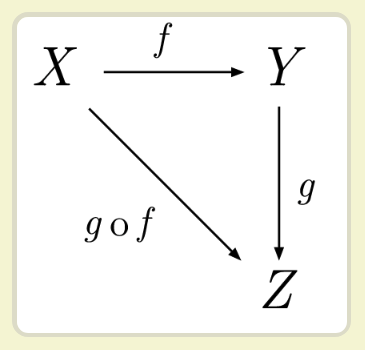
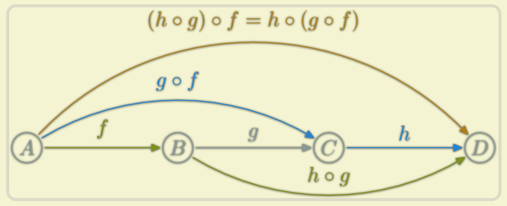

> 面试官：你好，你有用过函数式编程吗？
我：函数式？没有呢？
面试官：那有了解过吗？
我：额。。。也没有，贵公司主要使用函数式编程么？
面试官：嗯，不怎么使用，但我就是想问

又到了面试的季节，相比很多小伙伴会被面试官一顿连环问，面试造火箭，进去拧螺丝，可想要顺利入职还是得硬着头皮把火箭造出来才行。

最近不定期写一些跟面试相关的知识点，为大伙的面试打气加油。

这篇我们说说函数式编程。

函数式编程是一种编程范式，与面向对象、面向过程都是一种编程的方法论，简单的说就是如何设计我们的程序结构。

函数式的主要思想就是把运算过程写成一系列的函数调用，比如说面向过程我们是这么写的

```javascript
f(msg){
 // 分隔msg
 ...
 // 拼接msg
 ...
 // 其他处理
 ....
}
```

函数式就会变成这种形式

```javascript
a(msg){...// 分隔msg}
b(msg){...// 拼接msg}
c(msg){...// 其他处理}
f(msg) = a(msg).b(msg).c(msg)
```

相当于把原本一个大函数拆解成一个个独立的小函数，然后通过链式调用，把独立的小函数串联起来，已达到输出的结果与原本的大函数一致，有点类似于管道，或者说流水线，上一个工序处理结束，传给下一个工序，最后输出成品。

函数式编程，其函数必须满足一个基本条件：函数必须是没有副作用的，不能直接或间接修改除自身外的变量，仅仅是一种数据转换的行为。片草丛中过，既不沾花也不惹草。

函数式编程有两个最基本的运算：合成和柯里化。

在之前的文章有详细介绍过函数柯里化,请戳[用大白话介绍柯里化函数](https://juejin.im/post/5cb30832e51d456e8240dcbd)，我们在接着看另一个基本运算-合成

### 什么是compose

函数合成，英文名叫做 `compose` ，意思就是一个值要经过多个函数，才能变成另外一个值，将这个多个函数合并成一个函数，就是函数的合成，举个栗子
```javascript
var name = 'xiaoli'
name = a(name){...}
name = b(name){...}
name = c(name){...}
console.log(name)
```
name 经过三个函数才最终输出我们需要的值，那么函数合成后，变成如下
```javascript
var fn = compose(a,b,c)
console.log(fn(name))
```

这里引用阮一峰老师的一张图


函数组合还是非常好理解的，标准的函数组合还需要满足结合律，在引用阮一峰老师的的图


意思就是 `compose(a,b)` 生成的函数也必须是一个纯净的函数，对调用者来说这个生成的函数是透明的，调用者只关心 `a和b` 的实现即可。 

### compose 实现
我这里我要推荐把函数式编程玩的最溜的 `redux` ，也是这些大佬们把函数式编程在前端圈给推了起来。我们看代码

```javascript
// https://github.com/reduxjs/redux/blob/master/src/compose.js
/**
 * Composes single-argument functions from right to left. The rightmost
 * function can take multiple arguments as it provides the signature for
 * the resulting composite function.
 *
 * @param {...Function} funcs The functions to compose.
 * @returns {Function} A function obtained by composing the argument functions
 * from right to left. For example, compose(f, g, h) is identical to doing
 * (...args) => f(g(h(...args))).
 */

export default function compose(...funcs) {
  if (funcs.length === 0) {
    return arg => arg
  }

  if (funcs.length === 1) {
    return funcs[0]
  }

  return funcs.reduce((a, b) => (...args) => a(b(...args)))
}
```
是不是很精炼？ `Array.reduce` 大法好啊，巧妙的实现函数嵌套引用。

在看别的函数库如何实现的，先看看 `lodash.js` 的实现

```javascript
/**
 * Composes a function that returns the result of invoking the given functions
 * with the `this` binding of the created function, where each successive
 * invocation is supplied the return value of the previous.
 *
 * @since 3.0.0
 * @category Util
 * @param {Function[]} [funcs] The functions to invoke.
 * @returns {Function} Returns the new composite function.
 * @see flowRight
 * @example
 *
 * function square(n) {
 *   return n * n
 * }
 *
 * const addSquare = flow([add, square])
 * addSquare(1, 2)
 * // => 9
 */
function flow(funcs) {
  const length = funcs ? funcs.length : 0
  let index = length
  while (index--) {
    if (typeof funcs[index] != 'function') {
      throw new TypeError('Expected a function')
    }
  }
  return function(...args) {
    let index = 0
    let result = length ? funcs[index].apply(this, args) : args[0]
    while (++index < length) {
      result = funcs[index].call(this, result)
    }
    return result
  }
}
```

loadsh 看着要稍微复杂些，但兼容性更高，毕竟有些落后的浏览器没法支持reduce

`ramda.js` 一个更具有函数式代表的函数库，这个函数库非常有意思，每个函数都默认支持柯里化，对酷爱函数式编程的伙伴来说，那就是个大杀器啊，我们看下它 `compose` 的实现，注释略长，为了方便大家看，我把注释简化下

```javascript
// compose.js
import pipe from './pipe';
import reverse from './reverse';
/**
 * @func
 * @category Function
 * @sig ((y -> z), (x -> y), ..., (o -> p), ((a, b, ..., n) -> o)) -> ((a, b, ..., n) -> z)
 * @param {...Function} ...functions The functions to compose
 * @return {Function}
 * @see R.pipe
 * @symb R.compose(f, g, h)(a, b) = f(g(h(a, b)))
 */
export default function compose() {
  if (arguments.length === 0) {
    throw new Error('compose requires at least one argument');
  }
  return pipe.apply(this, reverse(arguments));
}

// pipe.js
import _pipe from './internal/_pipe';
import reduce from './reduce';
export default function pipe() {
  if (arguments.length === 0) {
    throw new Error('pipe requires at least one argument');
  }
  return _arity(
    arguments[0].length,
    reduce(_pipe, arguments[0], tail(arguments))
  );
}
// 封装的层次比较多，就不一一展开了
```
ramda 自己实现了reduce，所以兼容性也是OK的。

至于 `compose` 的函数执行顺序是从左到右还是右到左，这个无非是把传入的函数做个顺序调换。


### compose 应用
函数组合的使用场景还是多的，常见的数据处理，只要修改函数因子就可以输入不同的结果，不需要修改原有流程。

我们来看下 `koa2` 通过 `compose` 实现的洋葱模型，可以说是非常巧妙了，部分代码如下
```javascript
// https://github.com/koajs/koa/blob/master/lib/application.js
 /**
   * Return a request handler callback
   * for node's native http server.
   *
   * @return {Function}
   * @api public
   */

  callback() {
    const fn = compose(this.middleware);

    if (!this.listenerCount('error')) this.on('error', this.onerror);

    const handleRequest = (req, res) => {
      const ctx = this.createContext(req, res);
      return this.handleRequest(ctx, fn);
    };

    return handleRequest;
  }
// https://github.com/koajs/compose/blob/master/index.js
/**
 * Compose `middleware` returning
 * a fully valid middleware comprised
 * of all those which are passed.
 *
 * @param {Array} middleware
 * @return {Function}
 * @api public
 */

function compose (middleware) {
  if (!Array.isArray(middleware)) throw new TypeError('Middleware stack must be an array!')
  for (const fn of middleware) {
    if (typeof fn !== 'function') throw new TypeError('Middleware must be composed of functions!')
  }

  /**
   * @param {Object} context
   * @return {Promise}
   * @api public
   */

  return function (context, next) {
    // last called middleware #
    let index = -1
    return dispatch(0)
    function dispatch (i) {
      if (i <= index) return Promise.reject(new Error('next() called multiple times'))
      index = i
      let fn = middleware[i]
      if (i === middleware.length) fn = next
      if (!fn) return Promise.resolve()
      try {
        return Promise.resolve(fn(context, dispatch.bind(null, i + 1)));
      } catch (err) {
        return Promise.reject(err)
      }
    }
  }
}
```

### 小结
把 `compose` 和 `curry` 一起使用可以把函数这东东玩的非常灵活，但对编写函数就会有些要求，如何避免产生副作用，如何设计函数输入、输出，如何设计函数的边界等等。

在某些场景下使用函数式编程，不仅能代码更具扩展性，还能让自己的代码看起来逼格更高。

讲到这里，若在面试的时候把上面涉及到的点和栗子大致说出来，面试的这一关那绝对稳啦。

### 参考文章
http://www.ruanyifeng.com/blog/2017/02/fp-tutorial.html