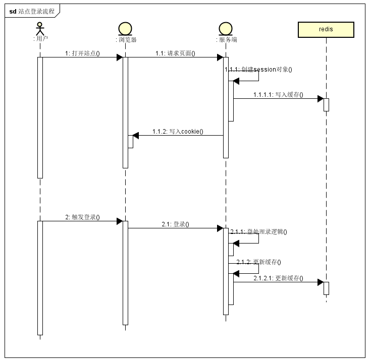
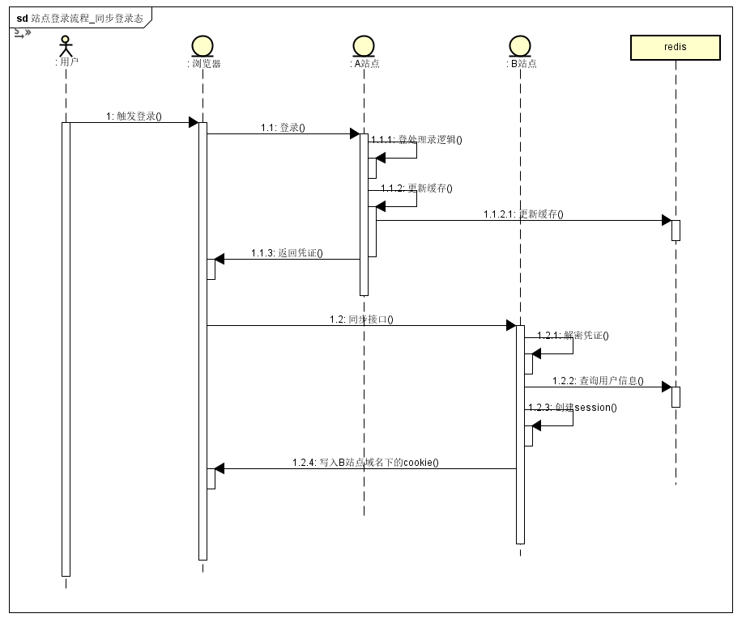
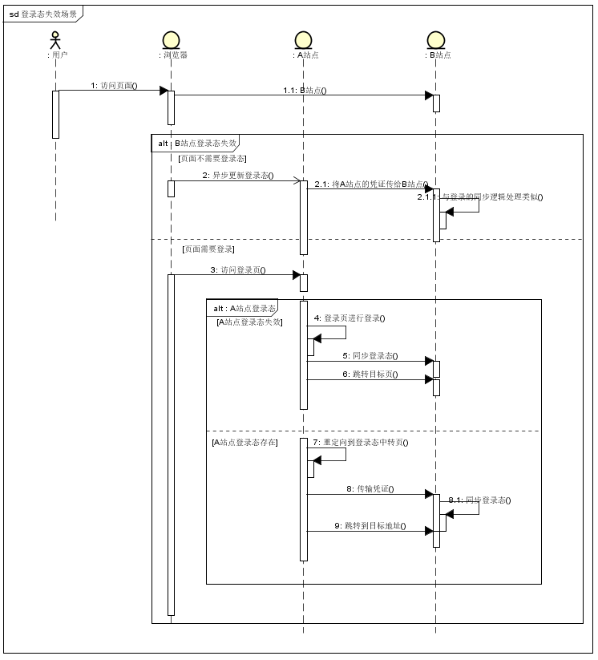

今天写一篇关于多域名下单点登录的实现。

有这么个场景，公司下有多个不同域名的站点，我们期望用户在任意一个站点下登录后，在打开另外几个站点时，也是已经登录的状态，这么一过程就是单点登录。

因为多个站点都是用的同一套用户体系，所以单点登录可以免去用户重复登录，让用户在站点切换的时候更加流畅，甚至是无感知。

单点登录所要实现的就是，某一站点登录后，将其登录态会同步到其他另外几个站点。

我们分两部分，先说单个站点的登录流程，在说同步登录态的流程。

### 登录相关架构
- 服务端采用 `nodejs` ，缓存采用 `redis` 。
- 用户登录凭证采用基于 `session` 的 `cookies` 维系，采用 `cookie` 作为登录凭证是目前比较主流的方式。
- `session` 信息用 `redis` 承载，从数据层面上看， `redis` 中存储 `session` 对象的 `key` 便是 `cookie` 中的 `value`
- `key`是由 `UUID` 生成的唯一标识
- 为了保证 `session` 与 `cookie` 保持对应， `session` 对象创建与修改都会触发服务端往浏览器写入 `cookie`

### 登录流程
我们先看单个站点的登录流程
1. 用户首次打开站点，服务端生成 `session` 对象，此时 `session` 中没有用户信息，同时服务端往浏览器写入 `cookie`
2. 用户触发登录操作
3. 服务端校验参数处理登录逻辑后，生成用户信息，将用户信息写入 `session` 对象，更新缓存 `redis`
我们来画个图，如下

### 同步登录态
一个站点完成登录后，接下来就是如何让其他站点也拥有登录态。
既然登录态是由 `cookie` 和 `session` 决定的，而 `cookie` 又是由 `session` 写入的，那么也就是说，只要把 `session` 同步到其它站点，其它站点只要获取到 `session` 后，就可以在该域名创建或更新  `cookie` ，这样一来，两个不同域名下的站点就拥有相同的登录信息了。

因此，同步登录态其实就是，如何同步 `session` 的问题。

而我们的 `session` 是采用 `redis` 作为载体，那么其他站点只要能获取到 `redis` 中存储的用户信息，不就可以创建自己的 `session` 对象了么？

没错！如何同步 `session` 的问题，就变成了如何让其他站点从 `redis` 中获取用户信息，也就是如何让其他站点知道存储该用户信息的 `redis key`

到了这一步，我们需要解决的问题就很明显啦：如何在不同站点间传输用户凭证。

为便于描述，我们假设有两个站点，分别为A站点和B站点。因为A、B站点的域名不同，基于同源策略， `cookie` 是没法共享的，所以我们采取主动请求的方式，将用户唯一凭证通过接口传过去。大致流程如下

1. A站点完成登录逻辑后，将用户凭证返回到浏览器，为了安全性，在传输凭证前，对凭证进行加密，可采用 `AES` 或者 `RSA`
2. A站点的客户端获取到凭证后，调用B站点提供的同步登录态接口，将凭证传过去
3. B站点的服务端获取到凭证，解密，查询缓存中的用户信息，创建 `session` 对象，写入B站点域名下的 `cookie` 信息
4. B站点的登录态同步完成。

基于上图，我们完善同步的时序图

### 同步登录态的场景
上面描述的是当用户首次登录时的同步流程，还需要考虑其他场景，比如，B站点获得的登录态失效了，这时候访问B站点页面，就需要在一次前往A站点同步登录态。
B站点上的页面分为两种，一种是需要登录态才可以访问的，一种是不需要登录态就可以访问的。

第一种情况下，需要重定向到A站点，可为啥要绕回去A站点呢？因为此时我们也不知道A站点的登录态是否也失效了，所以需要回到A站点判断A站点当前的登录态，若A站点登录态也失效了，那么就去登陆页进行重新登录，若A站点是有登陆态的，那么只要在做一次同步登录态的操作即可。

第二种情况，虽然B页面不需要登录态就可以查看，但是企业网站往往会在页面的head部分标记用户的登录态，所以为了让这部分的显示正常，我们在当前页面异步的去更新登录态即可。

若有其他场景，处理的逻辑与这个类似，本质无非就是在获取一次凭证，重新更新站点缓存。

### 跨域请求
因为要在A站点请求B域名下的接口，所以会有跨域问题，跨域问题常用的解决方式有如下几种
1. `JSONP` 很常见很通用的一种方式
2. `Image` 利用 `Image src` 可以绕过同源策略，所以通过构建一个 `Image` 发送给请求也是可行的，同时服务端也不需要做太多修改。
3. `CORS` 老的浏览器就没法支持，需要在服务端设置 `Access-Control-Allow-Origin`，允许任何域或指定的域发起的请求都可以获取当前服务器的数据。

### 小结
文章主要是已方案为主，就不放上详细的代码了，其实有了具体方案，代码的实现就不难啦。

多站点单点登录肯定还有其他优秀的解决方案，欢迎小伙伴们评论区一起交流探讨呀~