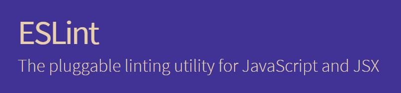
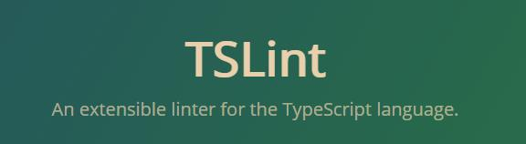
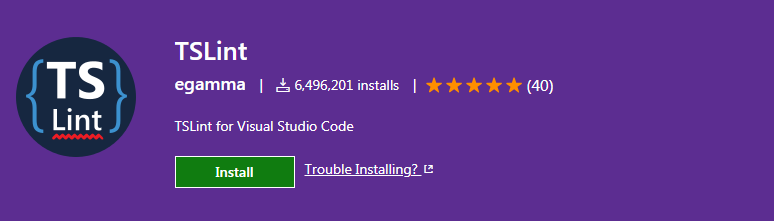
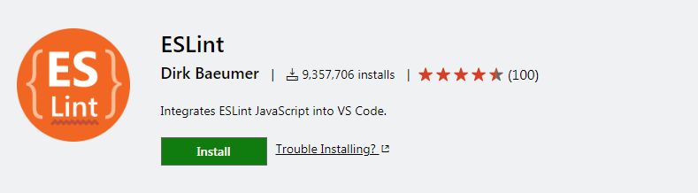

javascript作为前端的利器，上可撸AI，下可写驱动，（好吧，我承认我瞎编的），但是js作为一门弱类型的动态语言，在给我们带来方便的同时，也会悄悄的埋下坑，尤其是在大型项目中，一不小心，就要加班填坑，所以为了愉(早)快(下)工(班)作，我们选择使用eslint作为javascript的语法检查工具，tslint作为TypeScript 的语法检查工具，我们的目标是

> 1. 提高代码质量，避免低级的bug
> 2. 规范化编码，统一代码风格

[eslint官方地址](http://eslint.cn/)


[tslint官方地址](https://palantir.github.io/tslint/)


### 配置规则
eslint 和 tslint 的规则网上介绍已经非常多，配置项也简单易懂，为了避免该文章篇幅过长，配置规则文件另起一篇 [语法检查-配置规则](https://juejin.im/post/5b3859a36fb9a00e4d53fc85)

 #### eslint
```json
'extends': [
        "eslint:recommended",
        "standard",
        "plugin:react/recommended",
        "plugin:vue/base",
    ],
```
推荐这几个插件，都是业内流行的规范，插件地址如下

[standard](https://github.com/standard/eslint-config-standard)

react检查规范 [plugin:react/recommended](https://github.com/yannickcr/eslint-plugin-react) 

vue检查规范 [plugin:vue/base](https://github.com/vuejs/eslint-plugin-vue)

#### tslint

开启如下插件
```json
"extends": [
        "tslint:recommended"
    ]
```

#### 搭配vscode使用  
推荐两个插件

[tslint插件地址](https://marketplace.visualstudio.com/items?itemName=eg2.tslint)

[eslint插件地址](https://marketplace.visualstudio.com/items?itemName=dbaeumer.vscode-eslint)
#### 可共享的配置
当有多个项目的时候，我们就可以考虑将配置独立出来，统一管理，可以通过npm来管理的配置文件，将配置文件独立为一个项目维护，如果是内网项目，可使用 `npm install <git remote url>` 进行安装
详细使用方法如下：

`npm install <git remote url>: <protocol>://[<user>[:<password>]@]<hostname>[:<port>][:][/]<path>[#<commit-ish> | #semver:<semver>]`

tip：项目名称需要按照这样的格式 `eslint-config-mylint`

在配置文件`.eslintrc.js`中，改为如下
```javascript
module.exports = {
    "extends": [
        "mylint"
    ]
};
```


### 填坑

#### 行内规则
在某些情况下需要对个别文件和某行代码特殊处理时，使用注释的形式

##### eslint
该文件不参与语法校验 `/* eslint-disable */`

允许使用 console `/* eslint no-console: 0 */  or  /* eslint-disable no-console */`

##### tslint
该文件不参与语法校验 `/* tslint:disable */`

允许使用 console `/* tslint:disable:no-console */`

#### jquery 与箭头函数
1. 因为箭头函数的优势和其简洁，所以我们在项目中推荐使用箭头函数，箭头函数有个特性

> 箭头函数没有它自己的this值，箭头函数内的this值继承自外围作用域，没有局部this的绑定，即this不在是动态改变的

因部分项目还是基于`jquery`的，所以避免不了在dom元素上绑定事件监听函数，在使用 `function`的时候，dom事件被触发，回调函数中的`this`指向该`dom`，可当我们换成箭头函数时，`this`就不在是`dom`，而是上下文，举个栗子

```html
<div class="outer">
    <div class="inner">ww</div>
</div>
```

```javascript
    $('.outer').on('click', (event) => {
        console.log(this) // 不再是dom对象
        console.log(event.target) // 这个才是dom对象
    })
```

因此在修改dom元素的监听事件回调的时候，记得要同步将 `this` 一同修改

2. currentTarget 与 target 的区别与使用
在监听的节点里面还有嵌套节点的情况下，使用 `event.target` 将会有问题，栗子如下

```html
<div class="outer">
    <div class="inner">cc</div>
</div>
```

```javascript
 // 在需要监听的节点里，还有嵌套节点的情况下，需要注意
$('.outer').on('click', (event) => {
    console.log(event.target) // 获取的是点击的对象 inner
    console.log(event.currentTarget) // 获取的监听的对象 outer
})
```
所以在点击 `cc`的时候，`event.target`获取到的是点击的元素对象，而监听的对象就需要改成这样获取 `event.currentTarget`，这个才是`function` 下的 `this`

#### typescript 自定义声明文件
> TypeScript 是javascript的超集，用起来那是一个爽啊，谁用都说好

公司内部研发了一套UI框架，在配合ts使用的时候，发现很多方法缺少声明，所以我们需要编写声明文件，官方地址如下

[typescript-声明文件](https://www.tslang.cn/docs/handbook/declaration-files/library-structures.html)

### 鹅外话
css的格式化，我们推荐使用 [csscomb](http://csscomb.com/) ，且它还支持在线生成规则，不能在人性化了，目前对主流编辑器和构建工具都支持良好


### 参考文章

[Configuring ESLint](http://eslint.cn/docs/user-guide/configuring)

[通俗的方式理解动态类型，静态类型；强类型，弱类型](https://segmentfault.com/a/1190000012372372)

[currentTarget 与 target 的区别](http://www.calledt.com/target-and-currenttarget/)