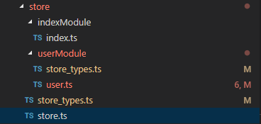

上一篇文章写了vue和typescript的整合，发现很多小伙伴对vue-cli构建出来的项目很感兴趣，所以今天打算写写怎么在vue-cli3.0的架子上，在进一步完善，整合出具备基础功能的前端架子，主要包括以下几个功能点：

1. webpack 打包扩展
2. css：sass支持、normalize.css
3. rem布局
4. 路由设计:懒加载、前置检查、合法性校验
5. api 设计
6. 请求体设计-防重复提交
7. vuex状态管理

### webpack 打包扩展
vue-cli3 最大的特点就是`零配置`，脚手架把webpack相关的配置都隐藏在@vue\preload-webpack-plugin中，默认的配置可以满足大部分应用场景，优点是我们可以节省很多折腾配置的时间，webpack对于新手来说，还是有点门槛的，这样一来，新人上手可以更关注于vue的编码上。缺点也很明显，对于想自己进行自定义配置的时候，就会稍微麻烦些。

#### 查看当前webpack的详细配置
使用 `vue inspect` 可以查看到详细的配置列表
#### 扩展webpack配置
当我们想要修改或者扩展webpack配置项时，可以在根目录下新增 `vue.config.js` 文件，列举个我自己写的简单小栗子

```javascript
// webpack 扩展
module.exports = {
    baseUrl: 'production' === process.env.NODE_ENV ?
        '/production-sub-path/' :
        '/',
    chainWebpack: config => {
        config.module
            .rule('images')
            .use('url-loader')
            .tap(options => Object.assign(options, { limit: 500 }));
    },
    devServer: {
        open: 'darwin' === process.platform,

        // host: '0.0.0.0',
        port: 8088,
        https: false,
        hotOnly: false,

        // proxy: 'https://api.douban.com' // string | Object 
        proxy: 'http://localhost:3000' // string | Object 
    },
    lintOnSave: false
};
```

官网[Vue.js 开发的标准工具](https://cli.vuejs.org/zh/) 的介绍非常详细，而且还有中文版，非常易懂, 

### sass支持
1. 组件中这么写 `<style lang="scss"></style>` 就可以支持scss语法
2. 在组件中import别的scss文件，写法如下 
```scss
<style lang="scss">
@import "./assets/style/app";
</style>
```
3. 在组件中使用自定义的 functions 和 mixin，我暂时没找到全局引用的办法，只能在需要使用的组件文件中手动引用，如下
```scss
<style lang="scss">
@import "../assets/style/functions";
@import "../assets/style/mixin";
.rem {
    height: px2rem(187.5px); //自定义的函数
}
.mimi {
    @include clearfix(); //自定义的mixin
}
</style>
```
4. 为了抹平各个浏览器间的差异，我们需要引入 normalize.css
```scss
// app.scss
@import "./node_modules/normalize.css/normalize"; //引用第三方normalize
@import "custom_normalize"; // 自定义的normalize
```

### rem布局
在移动端下使用rem布局是个不错的选择，既然我们使用里的scss，那么可以使用函数来简化我们的重复计算的工作。设计给到的通常是2倍图，宽为750px，那么我们可以将基准设为
`document.getElementsByTagName('html')[0].style.fontSize = window.innerWidth / 10 + 'px';` 然后写个转换函数，如下：

```scss
// _functions.scss
@function px2rem($px) {
    $rem: 75px;
    @return ($px/$rem) + rem;
}
```

我们在使用的时候，就可以这么写
```scss
.rem {
    height: px2rem(300px); // 2倍图下的宽是300px,
}
```
转换成css就是
```scss
.rem {
    height: 4rem;
}
```

### 路由设计
主要包括路由懒加载、路由前置检查、合法性校验逻辑，以下是我写的一个简单路由
```javascript
import Vue from 'vue';
import Router from 'vue-router';

// 路由懒加载
const getComponent = (name: string) => () => import(`./views/${name}.vue`);

Vue.use(Router);

const router = new Router({
    routes: [
        {
            path: '/',
            name: 'home',
            component: getComponent('home')
        },
        {
            path: '/about',
            name: 'about',
            component: getComponent('about'),
            meta: {
                auth: true
            }
        },
        {
            path: '*',
            name: 'not_fount',
            component: getComponent('notFount')
        }
    ]
});

/**
 * 路由前置检查
 */
router.beforeEach((to, from, next) => {
    // 合法性校验
    if (to.meta.auth) {
        console.log('into auth');
        next();
    }
    next();
});
export default router;
```

### api 设计
新建`service`文件夹用于存放api脚本，根据业务模块来划分文件，如用户相关的api一个文件、购买相关的一个文件，`api.ts`是各模块api的集合，如下
```typescript
// service/api.ts
export { userApi } from './user';
export { buyApi } from './buy';

// service/user.ts
export const userApi = {
    /**
     * 获取用户数据
     */
    userInfo: '/node_api/read/userInfo'
};
// service/buy.ts
export const buyApi = {
    /**
     * 购买
     */
    shoping: '/node_api/shop/buy'
};
```

这么划分，是为了项目结构和业务结构都足够清晰，同时可以避免单文件过长的问题。

### HTTP请求二次封装
发送http我使用的是非常流行的`axios`，我在其基础上，稍微进行简单的封装，然后暴露 `request`对象供调用。二次封装主要是为了解决以下几个问题
1. 简化参数，把一些常用参数都赋默认值，简化外部的使用，使得更加通用和利于排查问题。

2. 返回报文统一处理，我们通常需要对些高频的场景做相同的处理，如错误码、未登录等场景，可以在它提供的返回响应拦截器中，统一处理。

3. 防止重复提交，因为网络、后端处理的因素，有时接口响应会较慢，那么用户可能会在非常短的时间内，反复点击按钮，在第一次请求未返回的情况下，会再次发起新的请求，那么我们可以在axios提供的前置拦截器中搞点事情。关于防止重复请求这东东，我在以前的一篇文章有写过，[前端防止用户重复提交-js](https://juejin.im/post/5ac23eb7f265da238f12b86d) 感兴趣的小伙伴可以看看。

根据以上几点，下面是我封装的request文件，思路都比较简单，就不多说啦

```typescript
import axios from 'axios';
import qs from 'qs';

const Axios = axios.create({
    baseURL: '/',
    timeout: 10000,
    responseType: 'json',
    withCredentials: true,
    headers: {
        'Content-Type': 'application/x-www-form-urlencoded;charset=utf-8'
    }
});
const CancelToken = axios.CancelToken;
const requestMap = new Map();

// 请求前置拦截器
Axios.interceptors.request.use(
    config => {

        // 防重复提交
        const keyString = qs.stringify(Object.assign({}, { url: config.url, method: config.method }, config.data));
        if (requestMap.get(keyString)) {
            // 取消当前请求
            config.cancelToken = new CancelToken((cancel) => {
                cancel('Please slow down a little');
            });
        }
        requestMap.set(keyString, true);
        Object.assign(config, { _keyString: keyString });

        if (config.method === 'post' || config.method === 'put' || config.method === 'delete') {
            // 序列化
            config.data = qs.stringify(config.data);
        }

        return config;
    },
    error => {
        return Promise.reject(error);
    }
);

// 返回响应拦截器
Axios.interceptors.response.use(
    res => {
        // 重置requestMap
        const config: any = res.config;
        requestMap.set(config._keyString, false);

        if (res.status === 200) {
            return res.data;
        }
        // todo 弹窗提示等
        console.log(`request error：${res}`);
    },
    error => {
        return {
            code: -1
        };
    }
);

/**
 * @description
 * 请求
 * @param url
 * @param data
 * @param method
 */
const request = (url: string, data = {}, method = 'post') => {
    return Axios({
        method,
        url,
        data,
        params: method.toUpperCase() === 'GET' && data
    });

};

export { request };

```


### vuex状态管理
这里我根据业务模块来划分文件结构，如下图


分为首页模块和用户模块，每个模块都有自己独立的 state mutations 等，在`store.ts`中，引入各模块的文件，如下
```typescript
import Vue from 'vue';
import Vuex from 'vuex';
import index from './indexModule/index';
import user from './userModule/user';

Vue.use(Vuex);

export default new Vuex.Store({
    modules: {
        user,
        index
    }
});
```
大家注意到这里有个 `store_types.ts` 文件，这个文件主要是为了搭配ts使用的，文件内容如下
```typescript
export enum UserType {
    /**
     * 模块名称
     */
    'MODULE_NAME' = 'user',
    /**
     * 增加次数
     */
    'ADD_COUNT' = 'addCount',
    /**
     * 计算属性-获取十倍的值
     */
    'GET_TEM_COUNT' = 'getTenCount'
}
```
在看下组件中的使用方式：
```typescript
<script lang="ts">
import { UserType } from '@/store/store_types';
import { Component, Prop, Vue, Watch,Emit } from 'vue-property-decorator';
import {
    Action,
    Getter,
    Mutation,
    namespace,
    State
} from 'vuex-class';

@Component
export default class Test extends Vue {

    @State(state => state[UserType.MODULE_NAME].count) public fff!: number;

    @Getter(`${UserType.MODULE_NAME}/${UserType.GET_TEM_COUNT}`) public tenCount!: number;

    @Mutation(`${UserType.MODULE_NAME}/${UserType.ADD_COUNT}`) public addCount!: any;

}
</script>
```
虽然这么写的确有点绕，但有个好处，我们可以通过注释清晰知道方法和属性的说明

### 小结
以上是我根据自己工作中常见的场景来设计的，希望能对小伙伴能有帮助，其中设计不当的地方，欢迎小伙伴们在留言区一起探讨哈~