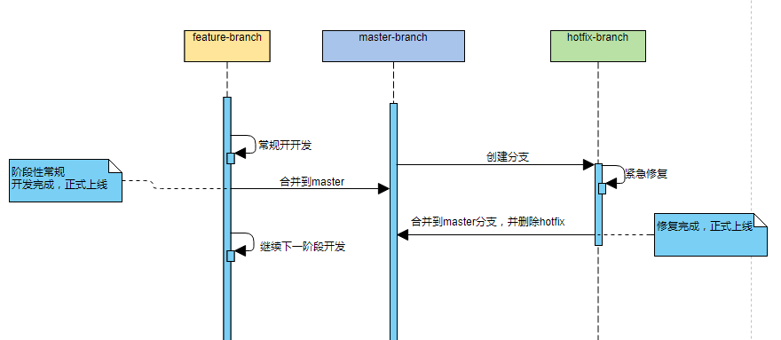
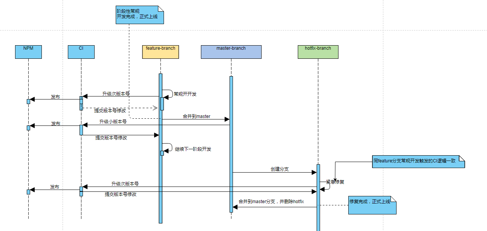

最近在把公司内部用的一个库发布到内网的npm私服上，仅仅是发布的话是比较简单的，但这个库是由多个人一起维护的，而且npm私服只有一套，所以生产环境和开发环境，用的是同一个，那么，我们的需求来了：如何设计npm包的开发流程和自动化发布流程。 这一套流程我们想要的达成如下目标

1. 支持团队协作，有开发提交代码，其他人能及时同步到最新代码
2. 能够支持常规迭代和hotfix上线
3. 同一版本开发、测试、生产环境的引用包的版本号都是一致的
3. 自动化发布，减少人工操作

先说下如何搭建npm私服和如何发包，不过这不是我们这篇要讲的重点，所以我们就简单介绍

#### npm私服搭建
目前比较主流的有 `nexus` 和 `Verdaccio`，因为 `Verdaccio` 要更轻量些，而且也满足我们的需求，所以我们选择它。 `Verdaccio` 搭建非常简单，直接使用默认配置就行

```
npm install -g verdaccio
or
yarn global add verdaccio
verdaccio
```

就这样，私服就搭建完成啦。

#### npm包发布

有了私服，我们先注册到本地的npm中
`npm set registry http://localhost:4873`
然后添加用户，如果是首次，则会新建用户
`npm adduser --registry http://localhost:4873`
最后是发布
`npm publish`

设定版本号有两种方式，一种是人工修改 `package.json` 中的 `version`  

```javascript
// package.json
{
  "name": "project",
  "version": "1.0.0",
}
```

另一种是通过 `npm version` 来修改版本号，提供有这如下参数

```
npm version [<newversion> | major | minor | patch | premajor | preminor | prepatch | prerelease [--preid=<prerelease-id>] | from-git]
```

详细解释如下：
> 
    newversion：自定义版本号，除了已经发布的版本号，想写啥写啥
    major：升级主版本号 1.0.0 -> 2.0.0
    minor：升级次版本号 1.0.0 -> 1.1.0
    patch：升级补丁号 1.0.0 -> 1.0.1  
    premajor：预备主版本
    preminor：预备次版本
    prerelease：预发布版本

在执行`npm version`后，会产生一条新的提交记录，比如说执行 `npm version 2.0.0`完后 ，查看log，会发现一条 commit message 为 `2.0.0` 的提交记录，至于为啥会生成这条记录呢？很简单，因为`npm version`这行命令其实是修改了 package.json 中的 version ，修改后并提交，所以就有这条新的提交记录。要是想自定义提交记录，可以这么写 `npm version 2.0.0 -m "Upgrade to %s for reasons"` 其中`%s`就是修改后的版本号。

### gitlab CI
我们打算使用 gitlab CI 来实现自动化发布，我们也简单介绍下 gitlab CI 的一些步骤和配置项。
1. 项目开启CI，选择一个公共的 runner，要是没有，那就只能自己弄一个。
2. 项目根目录新建 `.gitlab-ci.yml`，写入配置，详细的配置可以查看 [gtilab官网](https://docs.gitlab.com/ee/ci/)

```yml
# 定义 stages
stages:
  - build

定义 job
job1:
  stage: build
  script:
    - echo 'xxx'
```
3. 配置完成

### 设计阶段
我们要说的重点来啦，通过画图的方式来给大家介绍我们的设计思路。先来设定些约定

#### 分支的约定
项目的分支的规划，设定三个分支
1. `feature`分支：常规功能迭代
2. `master`分支：稳定分支
3. `hotfix`分支：当有紧急修改时，创建该分支，作为临时修复分支，这样可以不影响常规功能的开发

#### 版本号的约定
我们采用 `大版本:小版本:次版本号` 这种方式，每一次feature分支上的每次提交都触发此版本号升级，比如当前feature分支的版本号是 `1.1.5` 那么下一次提交就会升级为 `1.1.6` 并发布npm，小版本号跟着常规需求迭代往上升级，比如说当前是 `1.1.8` ，周期性的需求在明天上线，那么上线后，版本号就升级为 `1.2.0` 并发布npm，大家发现 `1.1.8` 和 `1.2.0` 是同样的代码，没错，之所以这么做是因为小版本号对应的是一个周期的常规修改，那么升级的 `1.2.0` 就是作为下一次的常规需求的版本号，这样一来，此版本号对应的是每一次提交，小版本号对应的是当前的开发阶段，这两个我们都可以通过CI来触发修改，不需要人工参与 ，剩下还有个大版本号，这个只有在大改版的情况下才由人工修改，一般来说升级大版本号的频率是比较低的，人工来来修改完全是OK的。

大家会发现每一次提交就触发 `npm version patch & npm publish` 感觉太频繁了，但为了能满足团队协作，只好做些小小的让步。所以此版本号在这里的作用并不是用来区分版本的，小版本号才是真正用来做版本区分的，那么在引用这个npm就要这么来控制版本号，举个栗子

```javascript
"my-package": "~1.2.0"
```

锁定大版本号和小版本号，不管我们开发过程中提交了多少次，我们引用都是最新的。

### 时序图
画了开发、发布的时序图，如下。

#### 开发流程时序图
开发时序图如下


#### 发布流程时序图



### 编码实现
主要是CI的编码，如下

```yml
# .gitlab-ci.yml
# 定义 stages
stages:
  - publish

# 定义 job
job2:
  stage: publish
  before_script:
    - cd /home/node/MY #进到项目目录
    - git checkout .
    - git checkout $CI_COMMIT_REF_NAME || git checkout -b $CI_COMMIT_REF_NAME
    - git pull -f -X theirs origin $CI_COMMIT_REF_NAME
    - yarn
  script:
    - node publish.js
```

```javascript
// publish.js
var shell = require('shelljs');
var git = require('git-last-commit');
var featureBranchName = 'feature-npm';
// 判断文本是否是版本号格式
function checkCommitMessage(subject) {
    return /^\d+.\d+.\d+$/g.test(subject)
}

// 获取最近一次提交，判断是否是版本号格式，若不是，则进行发布，
git.getLastCommit(function(err, commit) {
    console.log(commit);
    const { subject, sanitizedSubject } = commit;
    shell.exec('echo $CI_COMMIT_REF_NAME');

    if (!checkCommitMessage(subject)) {
        if (sanitizedSubject.indexOf(`Merge-branch-${featureBranchName}-into-master`) > -1) {
            shell.exec('git checkout .');
            shell.exec(`git checkout ${featureBranchName} || git checkout -b ${featureBranchName}`);
            shell.exec(`git pull -f -X theirs origin ${featureBranchName}`);
            shell.exec('npm version minor');
            shell.exec('npm publish');
            shell.exec(`git push origin ${featureBranchName}`);
        } else {
            shell.exec('npm version patch');
            shell.exec('npm publish');
            shell.exec('git push origin $CI_COMMIT_REF_NAME');
        }
     }
});

```

```json
// package.json
"scripts": {
    "test": "echo \"Error: no test specified\" && exit 1",
    "prepublish": "build script"
  },
```

发布脚本里有个函数 `checkCommitMessage` 用于判断最新的提交message是不是版本号格式，因为我们最后会有一步push的操作，push后会再一次触发CI，所以为了防止死循环，我们通过提交的message作为是否触发CI的依据，这么一来我们就要规范message的格式，我的建议是按照这个格式 `U ${修改的具体的内容}`。

### 小结
这个方案不是个普适性的方案，毕竟每个团队的开发流程都不一样，目前这个方案是适合我们目前的场景的。如果有小伙伴的场景跟我们的一致，可以尝试下，如果小伙伴们有更好的方案，欢迎一起交流呀~