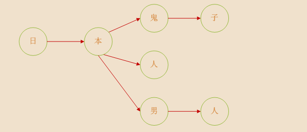
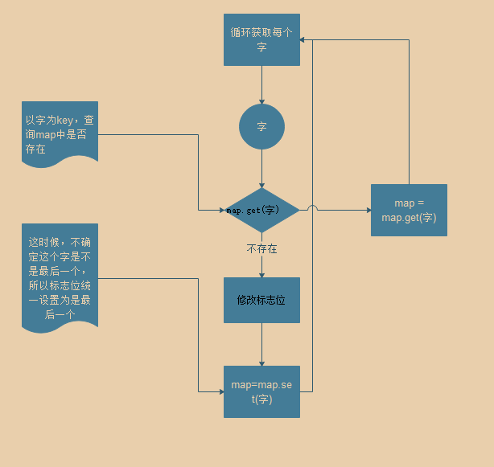
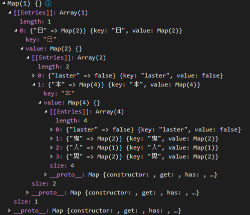
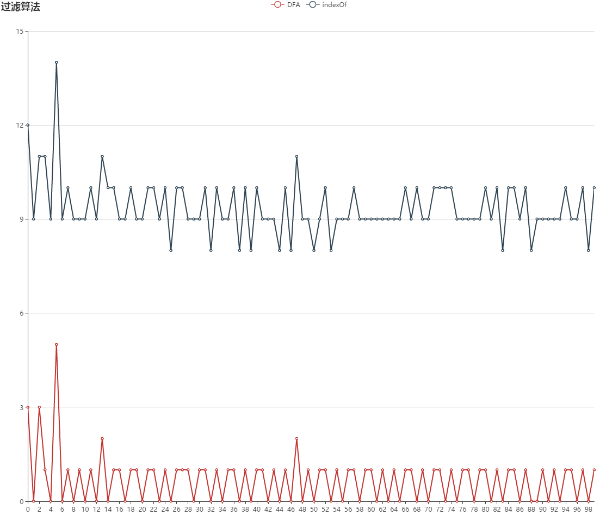

> 大半个月没有更新了，因为最近有点忙（其实是懒）

最近弄了一个用户发表评论的功能，用户上传了评论，再文章下可以看到自己的评论，但作为社会主义接班人，践行社会主义核心价值观，所以给评论敏感词过滤的功能不可少，在网上找了资料，发现已经有非常成熟的解决方案。
常用的方案用这么两种

1. 全文搜索，逐个匹配。这种听起来就不够高大上，在数据量大的情况下，会有效率问题，文末有比较
2. DFA算法-确定有限状态自动机 附上百科链接 [确定有限状态自动机](https://zh.wikipedia.org/wiki/%E7%A1%AE%E5%AE%9A%E6%9C%89%E9%99%90%E7%8A%B6%E6%80%81%E8%87%AA%E5%8A%A8%E6%9C%BA)

### DFA算法介绍
DFA是一种计算模型，数据源是一个有限个集合，通过当前状态和事件来确定下一个状态,即　状态+事件=下一状态，由此逐步构建一个有向图，其中的节点就是状态，所以在DFA算法中只有查找和判断，没有复杂的计算，从而提高算法效率

参考文章　[Java实现敏感词过滤](https://blog.csdn.net/chenssy/article/details/26961957)

### 实现逻辑
#### 构造数据结构
将敏感词转换成树结构，举例敏感词有着这么几个 `['日本鬼子','日本人','日本男人']`，那么数据结构如下（图片引用参考文章）



每个文字是一个节点，连续的节点组成一个词，`日本人`对应的就是中间的那条链，我们可以使用对象或者map来构建树，这里的栗子采用`map`构建节点，每个节点中有个状态标识，用来表示当前节点是不是最后一个，每条链路必须要有个终点节点，先来看下构建节点的流程图



#### 判断逻辑
先从文本的第一个字开始检查，比如`你我是日本鬼子`，第一个字 `你`，在树的第一层找不到这个节点，那么继续找第二个字，到了`日`的时候，第一层节点找到了，那么接着下一层节点中查找`本`，同时判断这个节点是不是结尾节点，若是结尾节点，则匹配成功了，反之继续匹配

### 代码实现
####构造数据结构
```javascript
/**
* @description
* 构造敏感词map
* @private
* @returns
*/
private makeSensitiveMap(sensitiveWordList) {
    // 构造根节点
    const result = new Map();
    for (const word of sensitiveWordList) {
        let map = result;
        for (let i = 0; i < word.length; i++) {
            // 依次获取字
            const char = word.charAt(i);
            // 判断是否存在
            if (map.get(char)) {
                // 获取下一层节点
                map = map.get(char);
            } else {
                // 将当前节点设置为非结尾节点
                if (map.get('laster') === true) {
                    map.set('laster', false);
                }
                const item = new Map();
                // 新增节点默认为结尾节点
                item.set('laster', true);
                map.set(char, item);
                map = map.get(char);
            }
        }

    }
    return result;
}
```
最终map结构如下



#### 查找敏感词
```javascript
/**
* @description
* 检查敏感词是否存在
* @private
* @param {any} txt
* @param {any} index
* @returns
*/
private checkSensitiveWord(sensitiveMap, txt, index) {
    let currentMap = sensitiveMap;
    let flag = false;
    let wordNum = 0;//记录过滤
    let sensitiveWord = ''; //记录过滤出来的敏感词
    for (let i = index; i < txt.length; i++) {
        const word = txt.charAt(i);
        currentMap = currentMap.get(word);
        if (currentMap) {
            wordNum++;
            sensitiveWord += word;
            if (currentMap.get('laster') === true) {
                // 表示已到词的结尾
                flag = true;
                break;
            }
        } else {
            break;
        }
    }
    // 两字成词
    if (wordNum < 2) {
        flag = false;
    }
    return { flag, sensitiveWord };
}
/**
* @description
* 判断文本中是否存在敏感词
* @param {any} txt
* @returns
*/
public filterSensitiveWord(txt, sensitiveMap) {
    let matchResult = { flag: false, sensitiveWord: '' };
    // 过滤掉除了中文、英文、数字之外的
    const txtTrim = txt.replace(/[^\u4e00-\u9fa5\u0030-\u0039\u0061-\u007a\u0041-\u005a]+/g, '');
    for (let i = 0; i < txtTrim.length; i++) {
        matchResult = checkSensitiveWord(sensitiveMap, txtTrim, i);
        if (matchResult.flag) {
            console.log(`sensitiveWord:${matchResult.sensitiveWord}`);
            break;
        }
    }
    return matchResult;
}
```

### 效率
为了看出DFA的效率，我做了个简单的小测试，测试的文本长度为5095个汉字，敏感词词库中有2000个敏感词，比较的算法分别为 DFA算法 和 String原生对象提供的 `indexOf `API做比较

```javascript
// 简单的字符串匹配-indexOf
ensitiveWords.forEach((word) => {
    if (ss.indexOf(word) !== -1) {
        console.log(word)
    }
})
```
分别将两个算法执行100次，得到如下结果


可直观看出，`DFA`的平均耗时是在1ms左右,最大为5ms；`indexOf`方式的平均耗时在9ms左右,最大为14ms，所以DFA效率上还是非常明显有优势的。