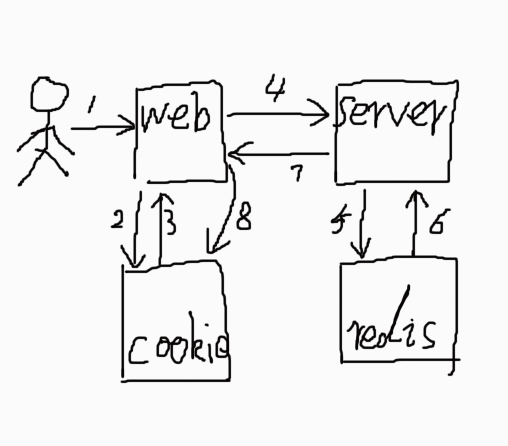

在网站的登陆界面，通常有三个元素，账号、密码、图形验证码，图形验证码的作用是为了防止恶意分子搞事请，但是图形验证码对正常用户来说，却是增加了用户的交互成本，所以对图形验证码设置如下策略：
### 策略
1. 用户首次打开登陆界面，图形验证码不作为登陆要素
2. 当用户累计输入错误的账号或密码达到我们设置的阀值，就将图形验证码显示出来，作为登陆的必输项
3. 在验证码已作为登陆要素的情况下，即使用户刷新浏览器，也还是需要输入验证码
4. 若用户换一个浏览器或者清空缓存，因为没有了前端缓存，所以不需要验证码，但服务器缓存仍在，所以还是取到放刷的目的

该策略保证了正常用户的登录体验，同时也防止恶意分子恶意操作

### 实现
实现逻辑：每当用户登陆失败，就在缓存中记录失败的次数，当次数达到了阀值，则告诉前端，将验证码显示出来，并设置cookie，避免用户刷新浏览器后验证码消失，若用户成功登陆，则讲前后端的对应缓存都清掉。

### 流程图
大致流程图如下，（因为没有安装visio，迷之画图将就一下）

步骤解释
1. 用户打开浏览器
2. 先查询cookie中是否有显示验证码的标识，`showImageCode`
3. 根据 `showImageCode`，来显示或隐藏验证码
4. 用户发起登陆操作(后续步骤均为登陆失败的情况)
5. 查询缓存中 `loginErrTimes` 是否存在，若不存在，新建一个，并设值为 `1` ，若已存在，则加`1`
6. 比较缓存中 `loginErrTimes`的值，是否大于设计的阀值，若已超过，则接口返回对应标识
7. 根据接口返回的，决定是否显示图形验证码
8. 当接口返回需要显示验证码的时候，设置cookie中的标识