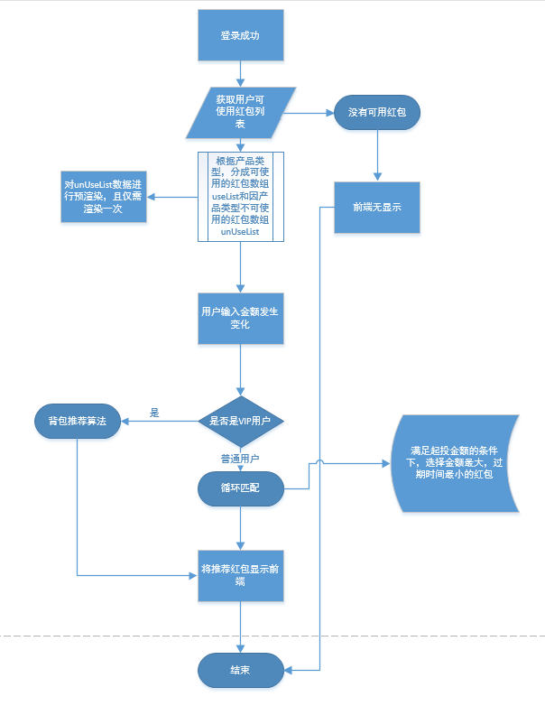
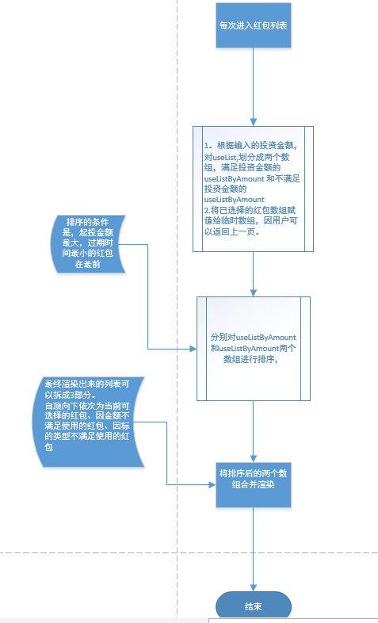
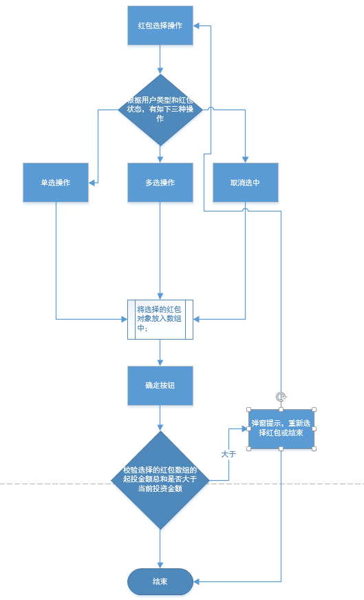

# 前端红包合并逻辑-简单示意图

> 根据投资金额 W 从 N 个红包中选出一个或多个红包，已达成当前投资金额下最优的红包组合

红包合并需求介绍
> 1. 红包要素：红包金额、红包起投金额、红包过期时间、红包抵扣比例（红包金额/红包起投金额）、红包使用产品
> 2. 在投资入口，根据用户输入的金额，和用户是否可以使用合并红包的标志，若用户不可使用红包。则推荐一个最优红包，若用户可以使用红包，则给用户推荐一个或多个，给用户推荐适合当前金额的最优红包，可一个或多个（金额最大，过期时间最早，抵扣比例最大）
> 3. 最优红包：优先金额最大，同等金额下过期时间最早的优先，以上都相等的情况下抵扣比例最大优先
> 4. 最优的红包要根据金额的变化实时计算出来，并渲染到界面
> 5. 前端显示的红包列表，其排序规则，红包列表可以看出是由三部分组成，从上至下，第一部分，是满足当前输入的投资金额且适用于当前产品；第二部分，是不满足当前输入的投资金额且但适用于当前产品；第三部分，是不适用于当前产品的

## 推荐最优红包
> 1. 寻找最优解
> 2. 分解成一个个的子问题:将投资金额分解
> 3. 动态规划
推荐算法使用的是背包算法(01背包算法)

```
{
    "amount": "39.00", // 红包金额-商品的价值
    "applyTo": "YY-X,YY-A,YY-B,YY-C,YY-CS",
    "effectiveTime": "2017-11-19",
    "expiredTime": "2018-01-19", // 红包过期时间
    "id": 13794023,
    "rangeBegin": "6000.00", // 红包起投金额-商品的重量
    "source": "LBHD",
    "status": "WSY"
}
investAmout:10000 // 背包容量
```


作者：简书
链接：http://www.jianshu.com/p/q81RER
來源：简书
著作权归作者所有。商业转载请联系作者获得授权，非商业转载请注明出处。

背包算法复杂度是O(nW),n是物品数量，W是背包最大承载重量,所以为了简化复杂度，加快处理速度，先对数据进行处理；因为目前红包的抵扣比例一般是千分之4或者千分之5，标的起投金额一般是100的整数倍，所以可以将起投金额和投资的金额同时缩小相同的倍数，已达到将 `W` 变小，因此，这个倍数自然就是红包起投金额的最大公约数(辗转相除法),为了减轻辗转相除法的复杂度，先对红包起投金额进行去重，在求他们的最大公约数。最后使用背包算法。

| pack        | amount           | rangeBegin  | 1---10000  |
| ------------- |:-------------:| -----:|-----:|
| a      | 100 | 2000 | xxx |
| b      | 200 |   4000 | xxx |
| c     | 300  |    7000 | xxx |


| pack        | amount           | rangeBegin  | 1---10  |
| ------------- |:-------------:| -----:|-----:|
| a      | 100 | 2 | xxx |
| b      | 200 |   4 | xxx |
| c     | 300  |    7 | xxx |

将表填完后，回溯法（N-0）算出具体的商品
所以在最前面需要对数组进行排序，排序规则：红包金额小大排序,若同等金额，优先过期时间早的放在最后，若过期时间相同，抵扣比例高的放在最后


### 投资界面流程图


## 进入红包列表渲染逻辑



## 红包选择操作


