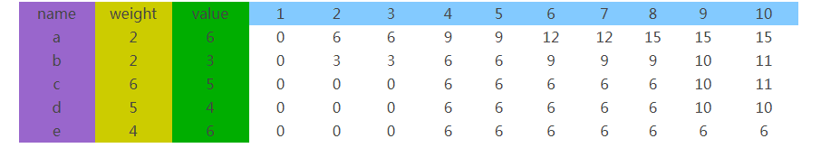

去年因为工作中的某个应用场景，需要使用到动态规划，为此花了些时间啃了啃背包算法
> 为啥去年的东西，今年才写粗来，应该是懒，不是我的原因

### 动态规划 Dynamic Programming
先简单说下什么是动态规划

引用维基百科的一句话 `通过把原问题分解为相对简单的子问题的方式求解复杂问题的方法`，通俗的理解就是，将一个复杂的问题拆解成相似的多个子问题，然后依次解决各个子问题，同时因为子问题的相似性，在计算过程中，需要同时将子问题的结果保存起来，在下一个同样的子问题时，直接查找即可，这样在同样的问题上就不会再次花费时间，所以核心思想就是拆解与记录

那么什么情况下可以使用动态规划呢 ？
需要具备以下特征
1. 有最优子结构

如果一个问题最优的解决方案可以通过最优它的子问题的解决方案来获取，那么这个问题就用最优子结构的属性，简单的理解就是用子问题的最优解来构造原问题的最优解

2. 子问题无后效性。即子问题的解一旦算出，就不会受到后续的子问题的影响而发生改变

3. 子问题重叠性质，即每次产生的子问题都不是一个全新的问题，是在前一个子问题的基础上变化而来的，所以子问题之间需要具有重叠性，这也是动态规划高效率的一个原因

### 背包算法


### 实例-红包合并

#### 场景

> 根据投资金额 W 从 N 个红包中选出一个或多个红包，已达成当前投资金额下最优的红包组合

红包合并需求介绍
> 1. 红包要素：红包金额、红包起投金额、红包过期时间、红包抵扣比例（红包金额/红包起投金额）、红包使用产品
> 2. 在投资入口，根据用户输入的金额，和用户是否可以使用合并红包的标志，若用户不可使用红包。则推荐一个最优红包，若用户可以使用红包，则给用户推荐一个或多个，给用户推荐适合当前金额的最优红包，可一个或多个（金额最大，过期时间最早，抵扣比例最大）
> 3. 最优红包：优先金额最大，同等金额下过期时间最早的优先，以上都相等的情况下抵扣比例最大优先
> 4. 最优的红包要根据金额的变化实时计算出来，并渲染到界面
> 5. 前端显示的红包列表，其排序规则，红包列表可以看出是由三部分组成，从上至下，第一部分，是满足当前输入的投资金额且适用于当前产品；第二部分，是不满足当前输入的投资金额且但适用于当前产品；第三部分，是不适用于当前产品的

## 推荐最优红包
> 1. 寻找最优解
> 2. 分解成一个个的子问题:将投资金额分解
> 3. 动态规划
推荐算法使用的是背包算法(01背包算法)

```
{
    "amount": "39.00", // 红包金额-商品的价值
    "applyTo": "YY-X,YY-A,YY-B,YY-C,YY-CS",
    "effectiveTime": "2017-11-19",
    "expiredTime": "2018-01-19", // 红包过期时间
    "id": 13794023,
    "rangeBegin": "6000.00", // 红包起投金额-商品的重量
    "source": "LBHD",
    "status": "WSY"
}
investAmout:10000 // 背包容量
```




作者：简书
链接：http://www.jianshu.com/p/q81RER
來源：简书
著作权归作者所有。商业转载请联系作者获得授权，非商业转载请注明出处。

背包算法复杂度是O(nW),n是物品数量，W是背包最大承载重量,所以为了简化复杂度，加快处理速度，先对数据进行处理；因为目前红包的抵扣比例一般是千分之4或者千分之5，标的起投金额一般是100的整数倍，所以可以将起投金额和投资的金额同时缩小相同的倍数，已达到将 `W` 变小，因此，这个倍数自然就是红包起投金额的最大公约数(辗转相除法),为了减轻辗转相除法的复杂度，先对红包起投金额进行去重，在求他们的最大公约数。最后使用背包算法。

| pack        | amount           | rangeBegin  | 1---10000  |
| ------------- |:-------------:| -----:|-----:|
| a      | 100 | 2000 | xxx |
| b      | 200 |   4000 | xxx |
| c     | 300  |    7000 | xxx |


| pack        | amount           | rangeBegin  | 1---10  |
| ------------- |:-------------:| -----:|-----:|
| a      | 100 | 2 | xxx |
| b      | 200 |   4 | xxx |
| c     | 300  |    7 | xxx |

将表填完后，回溯法（N-0）算出具体的商品
所以在最前面需要对数组进行排序，排序规则：红包金额小大排序,若同等金额，优先过期时间早的放在最后，若过期时间相同，抵扣比例高的放在最后


```JavaScript
/**
     * @description
     * 01背包算法
     * @author lizc
     * @private
     * @param {any} dataList 
     * @param {any} all 
     * @returns 
     * @memberof ChooseRedPack
     */
    private knapsack(dataList, all) {
        const returnList = [];
        for (let i = 0; i < dataList.length; i++) {
            // 构建二维数组
            returnList[i] = [];
            for (let j = 0; j < all; j++) { // 分割背包
                const currentBagWeight = j + 1; // 此时背包重量
                const currentWeight = dataList[i]._gcdrangeBegin; // 此时物品重量
                const currentValue = dataList[i].amount; // 此时的价值
                const lastW = currentBagWeight - currentWeight; // 此时背包重量减去此时要添加的物品后的重量

                // 求子问题最优解，并记录
                let fV = lastW >= 0 ? currentValue : 0;
                fV = fV + (i > 0 && returnList[i - 1][lastW - 1] ? returnList[i - 1][lastW - 1] : 0);
                const nV = i > 0 && returnList[i - 1][j] ? returnList[i - 1][j] : 0;
                returnList[i][j] = Math.max(fV, nV);
            }
        }

        // 回溯算法，算出选择的商品
        let y = all - 1;
        const selectItem = [];
        let i = dataList.length - 1;

        while (i > -1) {
            if (returnList[i][y] === (returnList[i - 1] && returnList[i - 1][y - dataList[i]._gcdrangeBegin] || 0) + dataList[i].amount) {
                selectItem.push(dataList[i]);
                y -= dataList[i]._gcdrangeBegin;
            }
            i--;
        }

        return selectItem;
    }
```

### 小结
谁说前端狗就不用懂算法的~  哈哈~  不要给自己设限~